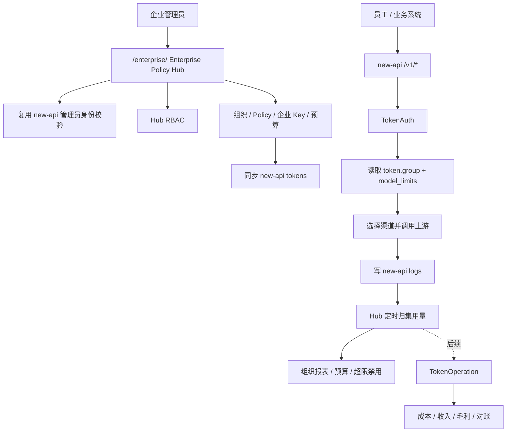
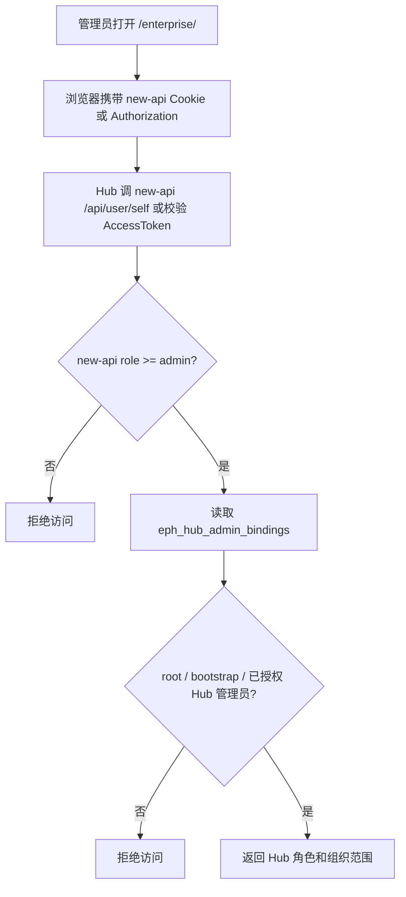
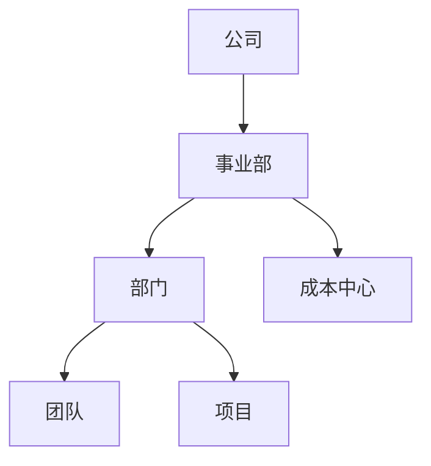
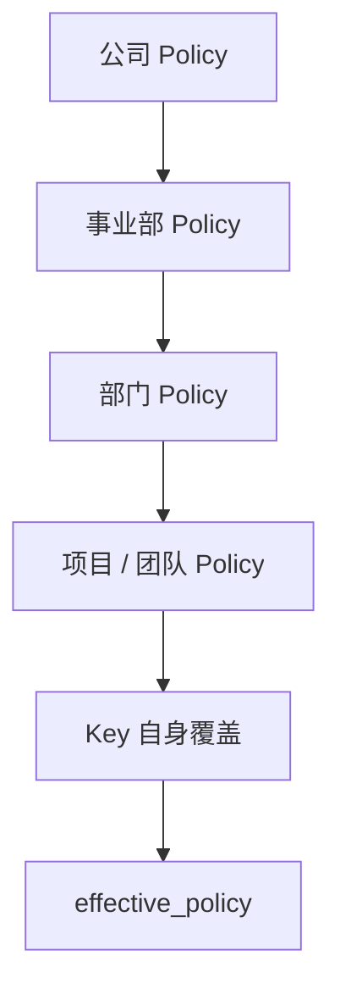
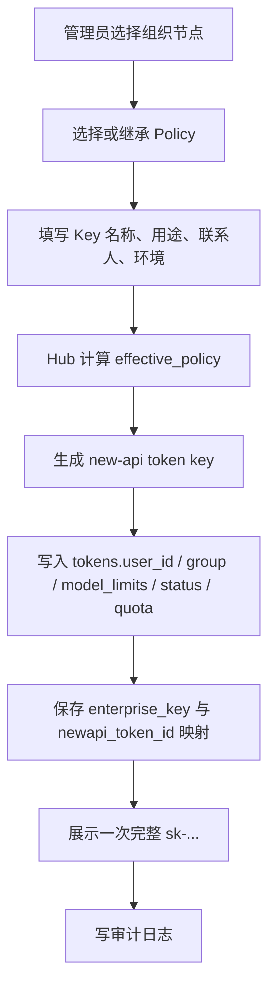
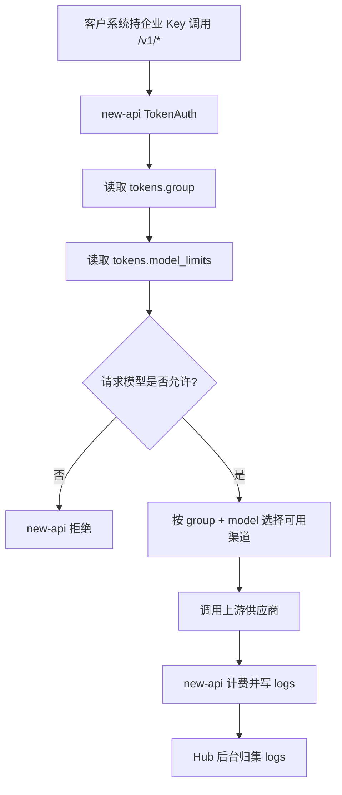
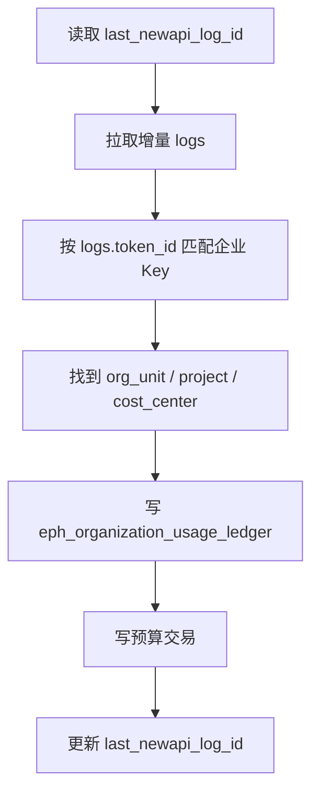
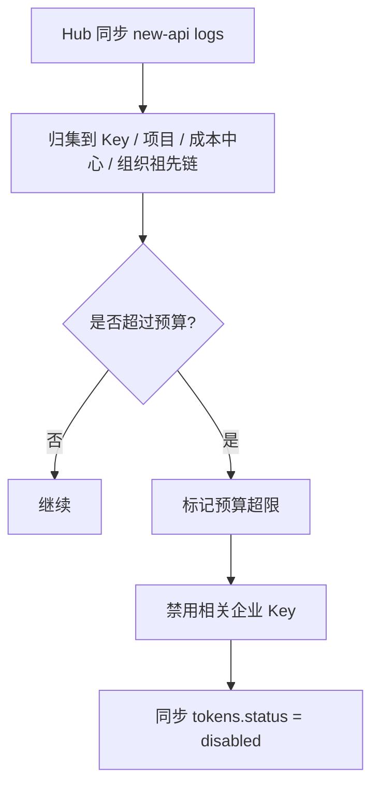

# Enterprise Policy Hub 执行方案

## 1. 目标

为企业客户提供一套旁路的组织、Key、策略、预算和用量管理服务，让客户不需要让员工注册 new-api 用户，也不需要让员工自己生成 API Key。

管理员在 Enterprise Policy Hub 中统一创建和管理企业 Key，再由 Hub 把企业语义编译成 new-api 已支持的 token 配置。业务调用仍然直接进入 new-api，new-api 继续负责鉴权、路由、计费、日志和上游调用。

第一期目标：

- 不改变 new-api 原始请求链路，不增加大模型调用时延。
- 不改 `TokenAuth`、渠道选择、计费、日志等核心逻辑。
- new-api 主仓只增加 token 缓存失效和原子同步两个窄接口，供 Hub 在数据库外部写 token 后保持 Redis 一致。
- 管理员统一创建 API Key。
- 支持公司、部门、团队、项目、成本中心等多层组织。
- 支持按组织配置可用模型、new-api group、Key 额度和预算。
- 支持从 new-api 日志归集部门、项目、Key 维度用量。
- 支持预算超限后禁用相关 Key。
- 支持复用 new-api 管理员身份登录旁路管理后台。
- 后续可对接 TokenOperation 做供应商成本、客户收入、毛利和账期对账。

## 2. 核心边界

### 2.1 new-api 继续负责

- 下游 API Key 鉴权。
- token group 生效。
- token model limits 生效。
- 渠道选择。
- 模型映射。
- 上游 API 调用。
- 使用日志。
- 当前面向客户的计费。
- 原有管理后台和渠道配置。

### 2.2 Enterprise Policy Hub 负责

- 企业组织架构。
- 企业策略 Policy。
- 管理员集中创建和管理企业 Key。
- 把 Policy 同步成 new-api token 的 group、model_limits、status、quota。
- 从 new-api logs 归集用量。
- 预算、告警、超限禁用。
- Hub 自己的组织级 RBAC。
- 后续同步企业维度到 TokenOperation。

### 2.3 第一期明确不做

- 不做 RelayMode 级控制。
- 不做“部门不能用视频/图片/音频”等 endpoint 类型控制。
- 不做前置请求代理。
- 不改变客户调用 new-api 的 API 地址。
- 不改变 new-api 的渠道路由和计费链路。
- 不把 Hub 菜单强行塞进 new-api 前端。

## 3. 整体架构



这个架构的关键点是：大模型请求不经过 Hub，所以 Hub 不会成为业务请求的性能瓶颈。

## 4. 管理入口

推荐生产入口：

```text
https://llm.ai.nexus-reach.com/enterprise/
```

Nginx 只新增一个独立 location：

```nginx
location /enterprise/ {
    proxy_pass http://127.0.0.1:3100/;
    proxy_set_header Host $host;
    proxy_set_header X-Real-IP $remote_addr;
    proxy_set_header X-Forwarded-For $proxy_add_x_forwarded_for;
    proxy_set_header X-Forwarded-Proto $scheme;
}
```

其余 `/v1/*`、`/api/*`、`/apidocs/` 保持走现有 new-api。

## 5. 权限方案

### 5.1 身份认证

Hub 不单独维护用户名密码。管理员访问 `/enterprise/` 时，Hub 复用 new-api 管理员身份。

流程：



new-api 只回答“这个登录者是不是管理员”。Hub 自己回答“这个管理员能管哪些组织、Key、预算和报表”。

### 5.2 new-api 角色映射

new-api 现有角色：

```text
RoleCommonUser = 1
RoleAdminUser  = 10
RoleRootUser   = 100
```

进入 Hub 的最低要求是 `role >= 10`。

生产建议：

- root 用户自动拥有 Hub 超级管理员权限。
- 其他 new-api admin 必须在 Hub 中显式授权。
- 不建议生产开启“任意 new-api admin 自动成为 Hub super admin”。

### 5.3 Hub 角色

| Hub 角色 | 权限 |
|---|---|
| `hub_super_admin` | 管理全部组织、Policy、Key、预算、同步配置、Hub 管理员 |
| `hub_org_admin` | 管理授权组织节点及其子节点 |
| `hub_key_admin` | 在授权组织范围内创建、禁用、轮换 Key，不允许改全局 Policy |
| `hub_finance_admin` | 查看预算、用量、成本中心和报表 |
| `hub_auditor` | 只读审计日志和报表 |

Hub 权限要有组织范围：

```text
admin -> hub_role + scope_org_unit_id
```

如果 `scope_org_unit_id = 销售事业部`，则该管理员只能管理销售事业部及其下级组织。

## 6. 组织架构

Hub 管理多层组织树：



组织节点建议字段：

```text
id
parent_id
path
name
code
type                 company / business_unit / department / team / project / cost_center
status
owner_admin_id
default_policy_id
default_group
created_at
updated_at
```

为了高效判断祖先和子孙关系，建议维护闭包表：

```text
eph_org_unit_closure
ancestor_id
descendant_id
depth
```

## 7. 组织与 new-api group 的关系

组织节点不是 new-api group。

组织节点代表企业管理语义：

```text
销售一部
研发平台组
AIGC 项目组
北美市场成本中心
```

new-api group 代表网关执行语义：

```text
default
AlbertG
wetoken
世纪互联海外
dept_sales
dept_rd
```

Hub 通过 Policy 把组织节点映射成 new-api group：

```text
销售一部 Policy.default_group = sales_standard
研发平台组 Policy.default_group = rd_high_quota
```

选择原则：

- 多个部门可以共享同一个 group，用于共享渠道池和价格。
- 如果部门要隔离渠道、模型价格或可用供应商，就配置不同 group。
- group 的底层渠道、模型、价格仍然在 new-api 管理后台维护。

## 8. Policy 设计

Policy 是企业策略，不等于 new-api group。

Policy 建议字段：

```text
id
name
description
default_group
allowed_models
denied_models
monthly_budget
daily_budget
currency
key_default_quota
inherit_mode
status
created_at
updated_at
```

示例：

```json
{
  "name": "sales-basic",
  "default_group": "sales_standard",
  "allowed_models": [
    "gpt-4o-mini",
    "claude-haiku",
    "doubao-seedance-2-0-fast-filter-off"
  ],
  "denied_models": [],
  "monthly_budget": 500,
  "currency": "USD",
  "key_default_quota": 100
}
```

## 9. Policy 继承规则

企业 Key 绑定到一个组织节点时，Hub 从根节点到当前节点合并策略：



推荐合并规则：

| 配置项 | 合并规则 |
|---|---|
| `allowed_models` | 默认取交集，子级只能收窄 |
| `denied_models` | 向下继承，优先级高于 allow |
| `default_group` | 子级覆盖父级 |
| `monthly_budget` | 子级预算不能超过父级约束 |
| `daily_budget` | 子级预算不能超过父级约束 |
| `key_default_quota` | 子级可收窄或覆盖 |

第一期不建议开放子级扩展模型。如果必须允许，需要上级显式开启类似 `allow_child_expand_models` 的开关。

## 10. 企业 Key 管理

企业 Key 是 Hub 中的管理对象，对应 new-api 的一条 token。

Hub 企业 Key 字段：

```text
id
name
org_unit_id
project_id
cost_center_id
policy_id
newapi_user_id
newapi_token_id
newapi_token_name
key_fingerprint
status
environment        prod / test / dev
purpose
contact
created_by
created_at
updated_at
```

new-api token 同步字段：

```text
tokens.name                 = enterprise_key.name
tokens.user_id              = 部门服务账号或企业服务账号
tokens.group                = effective_policy.default_group
tokens.model_limits_enabled = true
tokens.model_limits         = effective_policy.allowed_models
tokens.status               = enabled / disabled
tokens.remain_quota         = 可选，来自 key_default_quota 或预算
```

完整 `sk-...` 只在创建或轮换时返回一次。Hub 后续只保存指纹，不保存完整 Key。

## 11. 部门服务账号策略

客户不希望员工登录 new-api，所以 new-api 中只需要少量服务账号承载 token。

推荐第一期：

```text
dept-sales-service
dept-rd-service
dept-marketing-service
```

每个部门一个服务账号的好处：

- new-api 后台中也能按用户大致区分部门。
- token 归属更清晰。
- 不需要给真实员工创建 new-api 账号。

可选方案：

| 策略 | 适用场景 |
|---|---|
| 每部门一个服务账号 | 推荐第一期，隔离和管理成本平衡 |
| 全企业一个服务账号 | 最简单，但 new-api 中看不出部门 |
| 每项目一个服务账号 | 项目隔离强，但账号数量更多 |

## 12. Key 创建流程



## 13. 客户调用流程



这个流程不经过 Hub，因此不改变现有 API 调用地址，也不增加实时调用链路。

## 14. 同步机制

### 14.1 同步方向

第一期主要方向：

```text
Enterprise Policy Hub -> new-api tokens
new-api logs -> Enterprise Policy Hub
```

### 14.2 Hub 到 new-api token

同步内容：

| Hub effective_policy | new-api token |
|---|---|
| `default_group` | `tokens.group` |
| `allowed_models` | `tokens.model_limits` |
| 模型限制启用 | `tokens.model_limits_enabled = true` |
| Key 状态 | `tokens.status` |
| Key 额度 | `tokens.remain_quota` |
| 服务账号 | `tokens.user_id` |

同步要求：

- 幂等。
- 失败可重试。
- 不打印完整 key。
- 写审计日志。
- 写同步任务状态。

### 14.3 同步状态

建议维护：

```text
eph_newapi_sync_jobs
id
entity_type
entity_id
operation
status             pending / running / succeeded / failed
error_message
retry_count
created_at
updated_at
```

企业 Key 上也保留：

```text
sync_status        pending / synced / failed / disabled
last_sync_at
last_sync_error
```

## 15. 用量归集

Hub 周期性读取 new-api logs。

关键映射：

```text
logs.token_id -> eph_enterprise_keys.newapi_token_id
```

归集流程：



`eph_organization_usage_ledger` 建议字段：

```text
id
newapi_log_id
newapi_token_id
enterprise_key_id
org_unit_id
project_id
cost_center_id
model_name
channel_id
use_group
quota
amount
currency
created_at
```

说明：

- `quota` 来自 new-api 日志中的内部 quota。
- `amount` 是按当前 new-api quota 换算出来的面向客户金额或内部结算金额。
- 如果要做供应商真实成本，不应只靠 logs.quota，应交给 TokenOperation 的 provider event 和 adapter 体系处理。

## 16. 预算控制

第一期是准实时预算控制。



预算层级：

```text
公司预算
  -> 事业部预算
  -> 部门预算
  -> 项目预算
  -> Key 预算
```

一次调用金额要累计到相关链路：

```text
Key +10
项目 +10
部门 +10
事业部 +10
公司 +10
```

第一期不是强实时拦截，因此预算边界处可能存在一个同步周期内的超用。后续如果要强实时，需要考虑 new-api hook 或前置 Policy Proxy。

## 17. 数据表

第一期表统一使用 `eph_` 前缀，降低与社区 new-api 后续表名冲突的概率。

核心表：

```text
eph_org_units
eph_org_unit_closure
eph_hub_admin_bindings
eph_policies
eph_enterprise_keys
eph_budget_accounts
eph_budget_transactions
eph_organization_usage_ledger
eph_newapi_sync_jobs
eph_audit_logs
eph_settings
```

数据库要求：

- SQLite、MySQL、PostgreSQL 都要兼容。
- 优先使用 GORM。
- JSON 配置用 TEXT 存储。
- 不使用数据库私有 JSON 类型作为必要能力。
- 不使用 MySQL-only 或 PostgreSQL-only 语法。

## 18. 管理后台页面

第一期独立页面：

```text
/enterprise/
```

页面模块：

| 页面 | 功能 |
|---|---|
| 首页 | 当前管理员、Hub 角色、同步状态、预算摘要 |
| 组织架构 | 公司、事业部、部门、团队、项目、成本中心 |
| Policy 管理 | group、模型白名单、预算、额度、继承 |
| 企业 Key | 创建、启用、禁用、轮换、同步、查看指纹 |
| 预算管理 | 月预算、日预算、超限状态、重置 |
| 用量报表 | 按组织、项目、Key、模型、渠道查看 |
| 管理员授权 | 给 new-api admin 分配 Hub 角色和组织范围 |
| 审计日志 | 查看敏感操作记录 |
| TokenOperation | 后续对象同步、成本/收入/毛利状态 |

## 19. API 草案

### 19.1 身份

```text
GET  /enterprise/api/auth/me
POST /enterprise/api/auth/logout
```

### 19.2 组织

```text
GET    /enterprise/api/org-units
POST   /enterprise/api/org-units
PUT    /enterprise/api/org-units/{id}
DELETE /enterprise/api/org-units/{id}
```

### 19.3 Policy

```text
GET    /enterprise/api/policies
POST   /enterprise/api/policies
PUT    /enterprise/api/policies/{id}
DELETE /enterprise/api/policies/{id}
POST   /enterprise/api/policies/{id}/preview-effective
```

### 19.4 企业 Key

```text
GET  /enterprise/api/keys
POST /enterprise/api/keys
GET  /enterprise/api/keys/{id}
PUT  /enterprise/api/keys/{id}
POST /enterprise/api/keys/{id}/enable
POST /enterprise/api/keys/{id}/disable
POST /enterprise/api/keys/{id}/rotate
POST /enterprise/api/keys/{id}/sync
```

### 19.5 用量与预算

```text
GET  /enterprise/api/usage/summary
GET  /enterprise/api/usage/details
POST /enterprise/api/usage/sync
GET  /enterprise/api/budgets
PUT  /enterprise/api/budgets/{id}
POST /enterprise/api/budgets/{id}/reset
```

### 19.6 管理员与审计

```text
GET    /enterprise/api/admin-bindings
POST   /enterprise/api/admin-bindings
PUT    /enterprise/api/admin-bindings/{id}
DELETE /enterprise/api/admin-bindings/{id}
GET    /enterprise/api/audit-logs
```

### 19.7 TokenOperation

```text
GET  /enterprise/api/token-operation/status
POST /enterprise/api/token-operation/sync-objects
GET  /enterprise/api/token-operation/usage-details
```

`status` 返回 Hub 当前 TokenOperation 配置状态、对象同步 endpoint、是否已配置 gateway key，以及最近一次对象同步结果摘要。

`sync-objects` 只有 `hub_super_admin` 可调用。它会把 Hub 和 new-api 当前对象清单推送到：

```text
POST {EPH_TOKENOP_BASE_URL}/api/v1/gateway/objects/sync
```

请求头：

```text
x-gateway-key: ${EPH_TOKENOP_GATEWAY_KEY}
x-schema-version: gateway-objects-sync-v1
idempotency-key: eph-objects-sync-...
Content-Type: application/json
```

对象 ID 对齐原则：

| TokenOperation 对象 | Hub/new-api 来源 | ID 口径 |
|---|---|---|
| `customers[].gateway_customer_id` | new-api 用户 | 与 provider-events 中的 `customer_context.gateway_customer_id` 保持一致，使用 new-api user id 字符串 |
| `users[].gateway_user_id` | new-api 用户 | 与 provider-events 中的 `customer_context.gateway_user_id` 保持一致，使用 new-api user id 字符串 |
| `api_keys[].token_id` | new-api token | 与 provider-events 中的 `customer_context.token_id` 保持一致，使用 new-api token id 字符串 |
| `channels[].channel_id` | new-api channel | 与 provider-events 中的 `routing_context.channel_id` 保持一致，使用 new-api channel id 字符串 |
| `models[].model_name` | new-api ability/model | 与 provider-events 中的 `routing_context.model_name` 保持一致 |
| `models[].call_type` | Hub 根据模型名和 channel type 推断 | 只作为运营平台映射线索，正式结算仍以 provider-events 的 runtime call_type 为准 |
| `projects[]` | Hub org unit | 使用 `org_unit_id={id}`，用于企业组织维度映射和审计 |

对象状态字段发送 `object_status`，不直接复用 new-api 的原始 `status` 字段。Hub 会按 TokenOperation Gateway 合约统一成 `active`、`disabled`、`discovered`：

- new-api token 的 `enabled` / `active` 归一化为 `active`。
- new-api token 的 `disabled` 归一化为 `disabled`。
- new-api channel 的 `status=enabled` 归一化为 `active`，其他状态归一化为 `disabled`。
- 未知状态只作为发现对象上报，归一化为 `discovered`。

`usage-details` 读取运营平台 Gateway 合约中的客户侧结算明细：

```text
GET {EPH_TOKENOP_BASE_URL}/api/v1/gateway/usage-details
```

该接口可用于 Hub 显示客户应付金额、模型、call type、消费来源等客户安全字段。根据运营平台 Gateway 合约，supplier cost、gross profit、margin、supplier id、official price id 不会通过该接口返回；这些毛利字段需要运营平台额外提供管理/内部报表 API 后再接入 Hub。

## 20. TokenOperation 对接

Hub 不应该重新实现成本计费引擎。

准确成本、收入、毛利的推荐分工：

```text
new-api provider-events/outbox
  -> TokenOperation provider-events
  -> provider adapter 标准化 usage_quantities / usage_attributes
  -> TokenOperation settlement
  -> 成本 / 收入 / 毛利 / 对账
```

Hub 对 TokenOperation 的职责：

- 同步企业对象维度：组织、企业 Key、项目、成本中心。
- 保证 TokenOperation 能把用量事件归到企业组织结构。
- 后续展示 TokenOperation 返回的成本、收入、毛利和账期数据。

Hub 不应该用 `logs.quota` 反推供应商真实成本，因为视频、图片、音频、cache、异步任务、模型映射和供应商复杂计费都会导致误差。

建议新增配置：

```text
EPH_TOKENOP_ENABLED
EPH_TOKENOP_BASE_URL
EPH_TOKENOP_GATEWAY_KEY
EPH_TOKENOP_OBJECT_SYNC_ENABLED
EPH_TOKENOP_USAGE_EVENTS_ENABLED
EPH_TOKENOP_TIMEOUT_SECONDS
```

默认第一期只做对象同步，不主动发送 usage-events，避免和 new-api provider-events 重复结算。

当前落地策略：

- `EPH_TOKENOP_ENABLED=true` 才启用对接。
- `EPH_TOKENOP_OBJECT_SYNC_ENABLED` 默认启用，除非显式设为 `false`。
- `EPH_TOKENOP_USAGE_EVENTS_ENABLED` 默认关闭。
- Hub 对象同步不会发送完整 API Key，只发送 token id、Key 指纹和企业维度。
- Hub 不用 `logs.quota` 反推供应商成本；供应商成本由 new-api provider-events + TokenOperation adapter + settlement 计算。
- Hub 当前可以读取 TokenOperation Gateway `usage-details` 作为客户侧结算明细回显。
- Hub 后续可以展示 TokenOperation 的成本、收入、毛利和账期结果，但毛利字段需要运营平台提供管理/内部报表 API；Hub 不替代 TokenOperation 的结算引擎。
- 生产使用专用 Gateway Credential 对接 TokenOperation，`gateway_id=new-api-enterprise-policy-hub`，租户为 `B平台` / `tenant_73449e1533f34432`；credential secret 只保存在服务器 `/opt/new-api/enterprise-policy-hub.env`，不进入仓库、日志或文档。

## 21. 部署方案

Hub 使用同一个 Docker 镜像，但作为独立容器运行。

镜像中包含：

```text
/new-api
/hwdrama-proxy
/enterprise-policy-hub
```

Compose 示例：

```yaml
services:
  enterprise-policy-hub:
    image: same-new-api-image
    restart: unless-stopped
    entrypoint: ["/enterprise-policy-hub"]
    env_file:
      - /opt/new-api/.env
      - /opt/new-api/enterprise-policy-hub.env
    ports: []
```

`enterprise-policy-hub.env` 示例：

```text
EPH_PORT=3100
EPH_BASE_PATH=/enterprise
EPH_NEWAPI_BASE_URL=http://new-api:3000
EPH_BOOTSTRAP_ADMIN_IDS=1
EPH_ALLOW_ANY_NEWAPI_ADMIN=false
EPH_LOG_SYNC_INTERVAL_SECONDS=60
EPH_DISABLE_BACKGROUND_SYNC=false
EPH_TOKENOP_ENABLED=true
EPH_TOKENOP_BASE_URL=https://ops.ai.p35q.cn
EPH_TOKENOP_GATEWAY_KEY=***
EPH_TOKENOP_OBJECT_SYNC_ENABLED=true
EPH_TOKENOP_USAGE_EVENTS_ENABLED=false
EPH_TOKENOP_TIMEOUT_SECONDS=10
```

生产权限：

```bash
chmod 600 /opt/new-api/enterprise-policy-hub.env
```

## 22. 上线步骤

### 22.1 预检查

1. 确认 new-api 当前健康。
2. 确认数据库备份可用。
3. 确认 root/admin 用户 id。
4. 确认 Docker 和 Compose 可用。
5. 确认磁盘空间足够。
6. 确认 Nginx 配置可备份和 reload。

### 22.2 构建

建议默认从本机仓库打源码 tar 上传服务器构建，避免服务器无法访问 GitHub。

步骤：

1. 本机打包当前源码。
2. 上传到服务器临时构建目录。
3. 服务器构建新镜像。
4. 验证镜像中存在 `/enterprise-policy-hub`。

### 22.3 启动

推荐使用旁路部署脚本，只更新 Hub 容器，不重启 new-api：

```powershell
.\scripts\deploy-enterprise-policy-hub-nexus-sg.ps1 `
  -EnterpriseHubBootstrapAdminIds "<root_user_id>" `
  -TokenOperationEnabled true `
  -TokenOperationBaseUrl "https://ops.ai.p35q.cn" `
  -TokenOperationGatewayKey "<gateway_key>" `
  -AllowDirty `
  -Yes
```

如果不传 TokenOperation 参数，脚本会优先保留服务器现有 `/opt/new-api/enterprise-policy-hub.env` 中的 `EPH_TOKENOP_*` 配置，避免误清密钥。

只启动 Hub，不重启 new-api：

```bash
docker compose \
  -f /opt/new-api/docker-compose.yml \
  -f /opt/new-api/docker-compose.enterprise-policy-hub.override.yml \
  up -d --no-deps enterprise-policy-hub
```

健康检查：

```bash
curl http://127.0.0.1:3100/healthz
```

### 22.4 Nginx

1. 备份当前 Nginx 配置。
2. 加入 `/enterprise/` location。
3. 执行 `nginx -t`。
4. 通过后 reload。
5. 访问 `https://llm.ai.nexus-reach.com/enterprise/`。

## 23. 回滚方案

Hub 启动失败：

```bash
docker compose \
  -f /opt/new-api/docker-compose.yml \
  -f /opt/new-api/docker-compose.enterprise-policy-hub.override.yml \
  stop enterprise-policy-hub
```

Nginx 失败：

1. 恢复 Nginx 备份配置。
2. `nginx -t`。
3. reload。

同步异常：

1. 设置 `EPH_DISABLE_BACKGROUND_SYNC=true`。
2. 重启 Hub 容器。
3. 根据 `eph_newapi_sync_jobs` 和 `eph_audit_logs` 定位。
4. 必要时手工恢复 new-api token 的 group、model_limits、status、quota。

由于第一期不改变 new-api 请求链路，Hub 回滚不影响客户继续调用原有 API。

## 24. 验收测试

### 24.1 权限

| 场景 | 预期 |
|---|---|
| 未登录访问 `/enterprise/api/auth/me` | 401 |
| 普通用户访问 | 403 |
| new-api admin 但没有 Hub 授权 | 403 |
| bootstrap root 访问 | 200 |
| scope 外组织写操作 | 403 |

### 24.2 企业 Key

1. 创建组织节点。
2. 创建 Policy，设置 `default_group` 和模型白名单。
3. 创建企业 Key。
4. 确认 new-api token 被创建。
5. 确认 token group 正确。
6. 确认 token model_limits 正确。
7. 使用该 Key 调允许模型成功。
8. 使用该 Key 调未允许模型失败。

### 24.3 用量归集

1. 用企业 Key 完成一次 new-api 调用。
2. 手动触发 usage sync。
3. 确认 `eph_organization_usage_ledger` 有记录。
4. 确认 usage summary 能按组织、Key、模型展示。

### 24.4 预算

1. 给 Key 或部门设置小预算。
2. 产生调用。
3. 同步日志。
4. 确认预算交易写入。
5. 超限后企业 Key 被禁用。
6. new-api token 也被禁用。
7. 再次调用该 Key 失败。

### 24.5 TokenOperation 对象同步

1. 配置 `EPH_TOKENOP_ENABLED=true`。
2. 配置 `EPH_TOKENOP_BASE_URL=https://ops.ai.p35q.cn`。
3. 配置 `EPH_TOKENOP_GATEWAY_KEY`。
4. 打开 `/enterprise/` 的 TokenOperation 页签。
5. 点击“同步对象清单”。
6. 确认请求成功返回 `202` 或运营平台约定的 2xx。
7. 确认对象计数包含 customers、users、api_keys、channels、models。
8. 到运营平台查看 object readiness。
9. 确认 `api_keys[].token_id` 与 new-api provider-events 中的 `customer_context.token_id` 一致。
10. 确认 `channels[].channel_id` 与 provider-events 中的 `routing_context.channel_id` 一致。

## 25. 文件改动清单

建议把改动集中在少数稳定位置：

```text
cmd/enterprise-policy-hub/main.go
model/token.go
model/token_cache.go
service/task_billing.go
pkg/enterprisepolicyhub/config.go
pkg/enterprisepolicyhub/models.go
pkg/enterprisepolicyhub/app.go
pkg/enterprisepolicyhub/static.go
pkg/enterprisepolicyhub/token_operation.go
pkg/enterprisepolicyhub/*_test.go
Dockerfile
scripts/deploy-enterprise-policy-hub-nexus-sg.ps1
docs/enterprise-policy-hub-plan.md
docs/enterprise-policy-hub-execution-plan.md
```

尽量不要修改：

```text
middleware/auth.go
middleware/distributor.go
relay/*
controller/relay*
web/default/*
```

`model/token.go`、`model/token_cache.go` 和 `service/task_billing.go` 是例外：前两者只维护 `InvalidateTokenCache`、`UpdateTokenCacheAfterExternalWrite` 两个稳定接口；任务计费只增加把既有 `PublicTaskID` 写入预扣日志 `other.task_id` 的字段赋值，不增加 I/O。Hub 由此可以把异步预扣与最终结算关联起来。

这样后续跟随社区 new-api 更新时，只需要重点关注：

- `tokens` 表字段是否变化。
- `logs` 表字段是否变化。
- new-api 管理员身份接口是否变化。
- Dockerfile 构建阶段是否变化。

## 26. 执行顺序

推荐实施顺序：

1. 新增 Hub 服务骨架和健康检查。
2. 新增 `eph_` 数据表迁移。
3. 实现 new-api 管理员身份复用。
4. 实现 Hub RBAC。
5. 实现组织树。
6. 实现 Policy。
7. 实现企业 Key 创建和同步 new-api token。
8. 实现用量日志归集。
9. 实现预算和超限禁用。
10. 实现管理页面。
11. 实现部署脚本。
12. 做生产旁路部署，不重启 new-api。
13. 验收企业 Key、用量归集、预算禁用。
14. 再做 TokenOperation 对象同步。
15. 后续展示成本、收入、毛利。

## 26.1 当前实现状态

已实现：

- `cmd/enterprise-policy-hub/main.go` 独立服务入口。
- `pkg/enterprisepolicyhub` 旁路服务包。
- `eph_` 表迁移。
- new-api 管理员身份复用。
- Hub RBAC。
- 组织、Policy、企业 Key、预算、用量归集、审计。
- 企业 Key 同步到 new-api token。
- 企业 Key 同步已有 token 时会同步 `tokens.user_id`，避免部门服务账号变更后仍归属旧用户。
- Key 页面展示直接 Policy、继承后有效 Policy、管理状态、实际状态和预算阻断数量。
- `key_default_quota=0` 明确定义为不限额；重复同步不会重置已消费额度，调整额度上限时只应用上下限差值。
- Policy 日/月预算按 `EPH_BUDGET_TIMEZONE` 的自然日、自然月生成独立预算账户，并按组织祖先链、项目、成本中心和 Key 归集。
- `EPH_BUDGET_TIMEZONE` 未显式设置时继承 new-api 容器的 `TZ`；两边都没有配置时才回退 UTC。new-api 日志保存 Unix 秒，预算边界用同一时区把 Unix 秒划入自然日/月，避免跨日错位。
- 异步任务的预扣记录只在用量台账中标记为 `pending`，不提前归入某个自然日/月预算；任务完成后，预扣与补扣/退款统一按完成时间归入最终预算周期，避免跨日任务把一次实际消费拆到两个周期。
- 达到预算后写 `eph_budget_key_blocks` 并禁用受影响 token；新周期或退款降到阈值以下时只释放对应预算阻断，不会覆盖管理员手工禁用状态。
- 相同 Policy 同时挂在父子组织或 Key 上时，有效 Policy 只合并一次；各组织范围仍保留独立预算账户。
- 用量 ledger 已存在但预算流水缺失时，同步任务会幂等补写流水，避免局部失败后永久漏算预算。
- 异步任务预扣留在用量台账的 `pending` 状态，不写入任何预算账户；差额结算、失败退款或精确预扣任务完成后，按完成时间把实际总额写入对应预算账户。用量页面显示待结算、已结算和合计，预算页面只显示已经归属到周期的实际用量。
- denied-only Policy 会从当前启用渠道/能力编译具体模型白名单；多层 allowed_models 交集为空时禁用 token，避免空列表被解释成不限模型。
- 用量归集会把 new-api 退款日志转换成负 quota，并把预算流水方向标记为 `refund`。
- TokenOperation 对象同步接口。
- 独立管理页面 `/enterprise/`。
- Dockerfile 同镜像打包 `/enterprise-policy-hub`。
- 只更新 Hub 容器的生产部署脚本。

本地和远端验证：

- PowerShell 部署脚本语法检查通过。
- `/enterprise/` 静态页面内嵌 JavaScript 语法检查通过。
- Hub 相关文件 `git diff --check` 通过。
- 远端 Docker Go 环境执行 `go test ./pkg/enterprisepolicyhub ./model` 通过。
- 远端 Docker Go 环境执行 `go vet ./pkg/enterprisepolicyhub` 通过。
- 远端 Docker Go 环境执行 `go build ./cmd/enterprise-policy-hub` 通过。
- 远端 Docker builder 阶段构建通过，并确认镜像中 `/build/enterprise-policy-hub` 二进制存在且可执行。
- 生产服务器已旁路部署 `enterprise-policy-hub` 容器，镜像为 `zooyf/new-api:enterprise-hub-20260710T085159Z-2730a5ba3ae6`。
- 生产 Nginx 已加入 `/enterprise/` 路由，`https://llm.ai.nexus-reach.com/enterprise/healthz` 返回 200。
- 生产 `enterprise-policy-hub.env` 权限为 `600`，`EPH_NEWAPI_BASE_URL=http://new-api:3000`，避免容器内错误访问自身 `127.0.0.1:3000`。
- 生产未登录访问 `https://llm.ai.nexus-reach.com/enterprise/api/auth/me` 返回 new-api 鉴权链路的 401。
- 生产数据库已完成 `eph_` 表迁移，共 11 张表。
- 生产已配置 `EPH_TOKENOP_ENABLED=true`、`EPH_TOKENOP_BASE_URL=https://ops.ai.p35q.cn`、`EPH_TOKENOP_OBJECT_SYNC_ENABLED=true`、`EPH_TOKENOP_USAGE_EVENTS_ENABLED=false`。
- 生产已配置专用 `EPH_TOKENOP_GATEWAY_KEY`，密钥只保存在 `/opt/new-api/enterprise-policy-hub.env`，文件权限为 `600`。
- 生产 `GET /enterprise/api/token-operation/status` 返回 200，确认 TokenOperation 已启用且 gateway key 已配置。
- 生产 `POST /enterprise/api/token-operation/sync-objects` 返回 200，运营平台上游返回 202；本次对象同步批次为 `gsync_0bd581e501744240`，`received=16`、`created=0`、`updated=15`、`unchanged=1`、`invalid=0`。
- 本次对象同步计数为 `apps=1`、`channels=3`、`models=12`、`api_keys=0`、`customers=0`、`users=0`、`projects=0`；`api_keys/customers/users/projects=0` 是因为当前生产 Hub 尚未保留企业 Key/组织对象，前面的验收对象已清理。
- 运营平台 readiness 返回 `status=action`、`missingMappingCount=10`、`blockingCount=10`，表示运营平台侧还需要补模型、call type、价格或组织映射配置；这不是 Hub 到 TokenOperation 的链路失败。
- 生产 `GET /enterprise/api/token-operation/usage-details?limit=1` 返回 200，返回 `gatewayId=new-api-enterprise-policy-hub`、`tenantId=tenant_73449e1533f34432`、`count=0`。
- 生产 `eph_settings` 已记录 `tokenop_last_object_sync_status=202` 和最近一次同步响应。
- 生产已用临时 root access token 完成 Hub API 级验收，测试结束后已恢复 root 原 access token：
  - `GET /enterprise/api/auth/me` 返回 `hub_super_admin`。
  - `POST /enterprise/api/policies` 创建测试 Policy 成功。
  - `POST /enterprise/api/org-units` 创建测试组织成功。
  - `POST /enterprise/api/keys` 创建企业 Key 成功，返回完整 `sk-...` 一次，且同步出 new-api token。
  - new-api token 字段验证通过：`user_id=1`、`group=default`、`model_limits_enabled=true`、`model_limits=gpt-4o-mini`、`remain_quota=1000`。
  - 使用临时企业 Key 调用生产本机 `GET /v1/models` 返回 200，证明企业 Key 能进入 new-api 鉴权链路。
  - 插入一条受控 new-api 用量日志后，`POST /enterprise/api/usage/sync?limit=50` 返回 `scanned_logs=1`、`imported_ledgers=1`、`skipped_logs=0`、`disabled_key_count=1`。
  - 预算账户 `used_quota=20`，企业 Key 被置为 `disabled`，对应 new-api token status 变为 `2`。
  - 验收产生的测试组织、Policy、企业 Key、new-api token、受控日志、ledger、budget transaction 已清理，无残留。

仍需在运营平台侧完成的业务配置：

- 根据 readiness 的 missing mapping 提示，补齐模型、call type、价格、客户或组织映射。
- 生产 Hub 后续如果创建企业组织和企业 Key，需要再次触发对象同步，让运营平台接收 `customers/users/api_keys/projects`。
- 如果 Hub 需要展示供应商成本、毛利和内部结算，需要运营平台额外提供管理/内部报表 API；当前 Gateway `usage-details` 只返回客户安全字段。

## 27. 最终原则

这套方案的核心原则是：

```text
Hub 管企业语义。
new-api 管网关执行。
TokenOperation 管成本、收入、毛利和对账。
```

Hub 把企业语义编译成 new-api 已支持的 token 配置，再把 new-api 的日志还原成企业组织报表。第一期不改 new-api 核心请求链路，只维护两个 token 缓存一致性接口，最大限度降低生产风险和后续社区升级维护成本。
