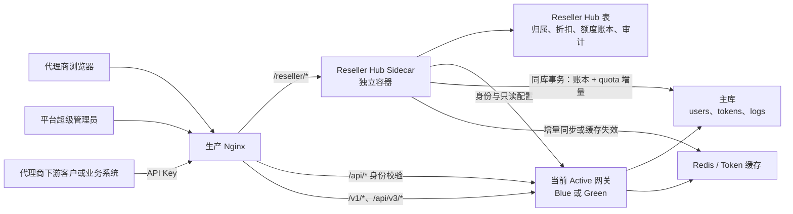
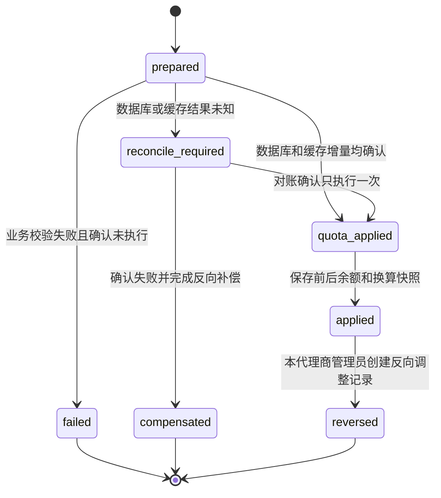
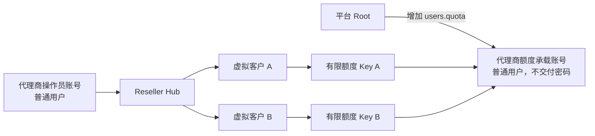
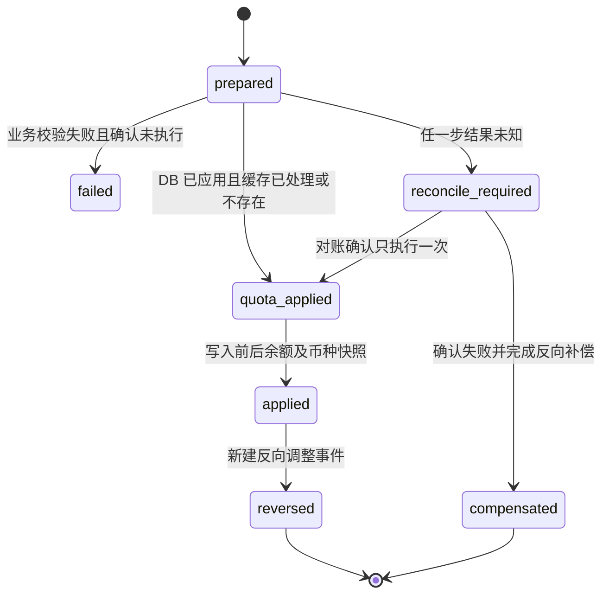

# Reseller Hub Sidecar 第一期实施规划

## 0. 文档状态

- 文档用途：记录 Reseller Hub Sidecar 第一期的产品边界、数据模型、权限隔离、额度调整和实施步骤，供后续直接进入开发。
- 当前状态：第一期采用“零核心改动、虚拟客户、额度受控 Key、软额度结算”方案；Sidecar 后端、独立管理页面和独立部署脚本已进入实现验证阶段，尚未部署生产。
- 记录日期：2026-07-22。
- 建议入口：`https://llm.ai.nexus-reach.com/reseller/`。
- 核心约束：客户模型请求仍然直接进入现有网关，Reseller Hub 不进入 `/v1/*`、`/api/v3/*` 或异步任务调用链路。
- 额度承诺：第一期不承诺实时硬额度。调用开始时余额为正即可进入现有调用链路，最终结算允许余额为负；余额小于等于零后拒绝新的调用。

## 1. 第一期目标

第一期建立一套独立运行的代理商管理旁路服务，使平台能够：

1. 由平台超级管理员创建、启用、停用和查看全部代理商。
2. 将现有系统账号绑定为代理商操作员，不新增第二套登录密码。
3. 代理商创建和管理自己的虚拟客户；虚拟客户不创建独立的现有系统登录账号。
4. 每个代理商只能查看和操作自己名下的虚拟客户和 Key，不能查看其他代理商的数据。
5. 平台超级管理员可以跨代理商查看全部数据和审计记录。
6. 代理商可以为自己的虚拟客户设置折扣。
7. 代理商可以在当前额度上增加或减少自己客户 Key 的可用额度；第一期不提供覆盖额度。
8. 所有额度变更形成不可修改的账本与审计记录，能够查明谁在什么时间因为什么原因调整了多少额度。
9. 复用现有网关的代理商额度承载账号、API Key、额度、鉴权、路由、计费和使用日志能力。
10. Sidecar 停止、升级或回滚时，不影响客户继续调用模型 API。
11. 实际消费和异步任务结算可以把 Key 余额扣成负数，负数完整记录为客户透支；补款先抵扣透支，恢复为正数后才重新允许调用。

## 2. 第一期不做的内容

为控制范围，第一期明确不做：

- 不让模型请求先经过 Reseller Hub。
- 不修改渠道选择、模型映射、供应商 Adapter 和客户计费公式。
- 不允许代理商管理渠道、上游密钥、系统定价或全局分组。
- 不实现代理商多级分销、下级代理、佣金和返利。
- 不实现在线支付、自动开票、提现和税务处理。
- 不把代理商折扣写入全局 `ModelRatio`、`GroupRatio` 或渠道倍率。
- 不允许代理商把虚拟客户转移给其他代理商；第一期只能由平台超级管理员执行转移。
- 不新增独立的代理商额度池表；复用一个专用普通用户的 `users.quota` 作为额度承载账号，并由平台超级管理员保证其额度充足。
- 不为虚拟客户创建可登录的真实用户账号；客户只获得由 Sidecar 管理的 API Key。
- 不支持一个客户使用多个 Active Key 共享同一实时额度；第一期一个客户只允许一个 Active Key。
- 不提供 `override`；额度管理只允许 `add`、`subtract` 和通过反向事件完成的冲正。
- 不承诺客户永不超额，也不阻止已经提交的异步任务在 Key 停用或余额不足后继续完成结算。
- 不默认展示完整 API Key；新建时只显示一次，后续仅显示名称、ID、前缀和指纹。
- 不承诺 Sidecar 中的“客户应收金额”等同于上游供应商成本；第一期折扣是下游销售口径。

### 2.1 已确认的业务假设

以下假设是第一期能够在不修改现有核心源码的前提下实施的组成部分，不属于待确认项：

1. **软额度而不是硬额度**：并发请求、信任额度旁路或最终费用高于预扣造成的超额可以接受，最终余额允许为负。
2. **负数立即阻断新调用**：有限额度 Key 的 `remain_quota <= 0` 时，现有 TokenAuth 拒绝后续请求；负数不是继续授信。
3. **接受短暂不一致**：Redis、数据库和批量更新之间可以短暂不同，但数据库账本和最终余额必须可恢复地收敛一致。
4. **在途任务继续结算**：停用 Key 或余额变负只阻止新任务；已有同步请求、异步任务、退款和完成态补扣继续按真实结果结算。
5. **共享额度由代理商负责**：平台超级管理员给额度承载账号增加 `users.quota`，代理商负责提前保证额度充足；余额不足导致旗下 Key 受影响属于已知运营责任。
6. **人工减少不得主动制造负数**：`subtract` 只能在执行时可确认余额足够时成功；后续或并发真实消费仍可使最终余额为负，并归类为消费透支。
7. **不做绝对值覆盖**：第一期删除 `override`，避免旧余额覆盖并发消费、退款或异步结算结果。
8. **调整额度不等于消费**：Sidecar 的 `add/subtract` 只改变 `tokens.remain_quota`，不得改变 `tokens.used_quota`；只有真实计费与退款才能改变 `used_quota`。

## 3. 总体架构



关键边界：

- 登录身份由现有系统确认。
- 代理商归属和数据范围由 Reseller Hub 确认。
- 虚拟客户归属由 Sidecar 管理，API Key 的鉴权和实际运行状态仍以现有系统为准。
- 第一期开启零核心模式：Sidecar 与现有系统共用主库和 Redis，账本与数据库增量在同一事务落库，随后对已有完整 Token 缓存执行同方向增量或缓存失效。
- 数据库是最终权威，Redis 是运行时缓存；中间状态由幂等事件和 reconciler 收敛，不使用旧余额快照覆盖新余额。
- 客户模型请求不经过 Reseller Hub，因此 Sidecar 不增加模型调用延迟。

### 3.1 “不影响现有系统”的准确边界

本文所称“不影响”是指：

- 不改变 `/v1/*`、`/api/v3/*` 和现有 `/api/*` 请求路由；
- 不在模型请求、流式响应、异步任务提交或任务查询链路中增加一跳；
- 部署、升级、停止和回滚 Sidecar 不重启当前 Active Blue/Green 服务；
- 不修改现有核心表 Schema，不启动现有系统全量迁移和后台任务；
- 不修改未纳管用户、Token、额度、状态、日志或 Redis 缓存；
- Sidecar 故障只影响 `/reseller/` 管理页面和额度管理操作，客户模型调用继续走现有网关；
- 通过独立连接池、CPU/内存限制和单 Leader 控制共享数据库、Redis 的附加负载。

以下属于产品功能的预期影响，不应误解为“完全只读”：Sidecar 会创建专用额度承载账号下的受管 Key，并按照代理商明确操作修改这些 Key 的 `remain_quota`、启停状态以及额度承载账号的 `users.quota`。这些变化只允许发生在 Sidecar 已登记归属的对象上，必须有账本和审计记录。

## 4. 身份与权限模型

### 4.1 角色

| Sidecar 角色 | 身份来源 | 数据范围 | 第一期权限 |
|---|---|---|---|
| `hub_super_admin` | 现有系统 `RoleRootUser = 100` | 全部代理商 | 管理代理商和成员，查看客户、折扣、额度账本及审计 |
| `reseller_admin` | 绑定的现有系统账号 | 单个代理商 | 管理本代理商虚拟客户、Key、折扣和额度 |
| `reseller_viewer` | 绑定的现有系统账号 | 单个代理商 | 只读查看本代理商客户、额度和用量 |

第一期一个操作员只能绑定一个代理商。多代理商成员和跨代理商财务角色放到后续阶段。

### 4.2 复用登录身份，但不复用全局数据权限

推荐流程：

```text
浏览器登录现有系统
  -> 携带同域 session cookie 打开 /reseller/
  -> Sidecar 向现有系统校验当前账号 ID、状态和系统角色
  -> Sidecar 查询 reseller_memberships
  -> 生成短期 Sidecar session
  -> 后续每个请求再次执行 Sidecar RBAC 和 reseller_id 范围校验
```

Sidecar 不读取密码哈希，不保存现有系统密码，也不共享可反序列化现有 session 的服务端密钥。

### 4.3 关于“代理商使用现有管理员账号”的安全结论

现有 `RoleAdminUser = 10` 是系统级管理员。当前用户管理接口并没有原生的 `reseller_id` 数据范围；如果代理商账号继续保留全局管理员权限，它仍可能绕过 Sidecar，直接调用现有管理员接口查看其他用户。

因此分成两种模式：

| 模式 | 做法 | 隔离结论 |
|---|---|---|
| 推荐安全模式 | 代理商使用现有普通用户账号登录，再由 Sidecar 授予 `reseller_admin` | 能实现完整代理商隔离 |
| 兼容模式 | 把已有系统管理员绑定为 `reseller_admin` | Sidecar 内隔离有效，但该账号在原后台仍保留全局管理员能力 |

生产验收“代理商之间不可见”时必须采用推荐安全模式。平台 Root 自动拥有 `hub_super_admin`，不受单代理商范围限制。

## 5. 数据归属与隔离规则

所有代理商业务表必须包含 `reseller_id`。任何来自代理商的查询和写入都不得直接按前端提交的 `reseller_id` 执行，而是使用当前 Sidecar session 中的归属：

```text
effective_reseller_id = current_sidecar_session.reseller_id
```

每个对象访问必须同时满足：

```text
object.id = requested_id
AND object.reseller_id = effective_reseller_id
AND object.deleted_at IS NULL
```

跨代理商访问统一返回 `404`，避免用 `403` 暴露对象是否存在。Root 查询时才允许显式传入代理商筛选条件。

必须执行归属校验的对象包括：

- 虚拟客户；
- API Key；
- 折扣版本；
- 额度调整单；
- 用量汇总；
- 审计日志；
- 导出任务。

## 6. 与现有对象的映射

| Reseller Hub 概念 | 现有对象 | 说明 |
|---|---|---|
| 代理商操作员 | `users.id` | 只复用身份，不以 `users.group` 表示代理商归属 |
| 代理商额度承载账号 | `users.id`、`users.quota` | 专用普通用户；平台超级管理员增加共享额度，不把账号密码交付代理商 |
| 代理商下游客户 | Sidecar `reseller_hub_customers` | 虚拟客户，不创建真实用户记录，不允许登录现有控制台 |
| 下游调用凭证 | `tokens.id` | 有限额度 API Key，仍由现有 TokenAuth 鉴权；一个客户第一期只允许一个 Active Key |
| 客户可用额度 | `tokens.remain_quota` | 第一期开启 `unlimited_quota=false`，作为客户软额度和透支记录字段 |
| 客户累计实际消费 | `tokens.used_quota` | 只由真实调用计费和退款改变；Sidecar 人工增减额度不得修改 |
| 请求消耗 | `logs.quota` | 用于代理商用量与客户金额计算 |
| 模型和渠道信息 | `logs.model_name`、`logs.channel_id` | 只读展示，不允许代理商修改渠道 |
| 代理商归属 | Sidecar `reseller_hub_customers` | 不复用 `users.group`，避免把商业归属和路由分组混在一起 |

`users.group` 和 `tokens.group` 继续承担现有路由语义，不能用来代替 `reseller_id`。

## 7. 第一期数据表

表名建议统一使用 `reseller_hub_` 前缀。字段类型必须兼容 SQLite、MySQL 和 PostgreSQL。

### 7.1 `reseller_hub_resellers`

| 字段 | 含义 |
|---|---|
| `id` | 代理商内部 ID |
| `code` | 稳定且唯一的代理商编码，创建后不可修改 |
| `name` | 展示名称 |
| `status` | `active`、`suspended`、`closed` |
| `default_discount_bps` | 默认折扣，万分比；`8500` 表示按标准价的 85% |
| `quota_carrier_user_id` | 本代理商专用额度承载账号的 `users.id`；一个承载账号第一期只归属一个代理商 |
| `created_by_user_id` | 创建代理商的平台账号 ID |
| `created_at`、`updated_at`、`deleted_at` | 生命周期字段 |

### 7.2 `reseller_hub_memberships`

| 字段 | 含义 |
|---|---|
| `id` | 成员关系 ID |
| `reseller_id` | 所属代理商 |
| `new_api_user_id` | 登录身份对应的现有用户 ID，不保存密码 |
| `role` | `reseller_admin` 或 `reseller_viewer` |
| `status` | `active` 或 `disabled` |
| `created_at`、`updated_at` | 生命周期字段 |

`new_api_user_id` 第一期设置唯一约束，避免同一账号同时进入两个代理商作用域。

### 7.3 `reseller_hub_customers`

| 字段 | 含义 |
|---|---|
| `id` | Sidecar 客户 ID |
| `reseller_id` | 强制归属字段 |
| `active_token_mapping_id` | 当前 Active Key 映射；可空，同一客户第一期最多一个 |
| `display_name` | 代理商看到的客户名称 |
| `external_ref` | 代理商自己的客户编号，可空；同代理商内唯一 |
| `discount_bps` | 客户折扣；为空时继承代理商默认折扣 |
| `status` | `active`、`suspended`、`closed` |
| `created_by_user_id` | 创建人 |
| `created_at`、`updated_at`、`deleted_at` | 生命周期字段 |

虚拟客户不是现有系统用户，不具有用户名、密码或控制台登录能力。它通过 Token 映射归属到代理商，并通过 `logs.token_id` 聚合用量。

### 7.4 `reseller_hub_customer_tokens`

| 字段 | 含义 |
|---|---|
| `id` | 映射 ID |
| `reseller_id`、`customer_id` | 强制归属字段 |
| `new_api_token_id` | 对应 `tokens.id`，全生命周期不得复用给其他客户 |
| `quota_carrier_user_id` | Token 所属的额度承载账号，应等于代理商配置 |
| `status` | `active`、`retiring`、`retired` |
| `effective_at`、`ended_at` | 映射有效期，用于历史用量归属 |
| `created_by_user_id`、`created_at` | 创建者与创建时间 |

`reseller_hub_customers.active_token_mapping_id` 与该表共同保证一个客户只有一个 Active Key。为兼容 SQLite、MySQL 和 PostgreSQL，不依赖部分唯一索引；由创建 Key 的事务锁定客户行、检查当前映射并更新指针。

### 7.5 `reseller_hub_discount_versions`

| 字段 | 含义 |
|---|---|
| `id` | 折扣版本 ID |
| `reseller_id`、`customer_id` | 数据归属 |
| `discount_bps` | 本版本折扣 |
| `effective_at` | 生效时间 |
| `ended_at` | 失效时间，可空 |
| `reason` | 变更原因 |
| `created_by_user_id`、`created_at` | 操作者与创建时间 |

折扣采用版本表而不是直接覆盖历史值，保证历史用量仍能使用当时的折扣还原客户金额。

### 7.6 `reseller_hub_quota_ledger`

| 字段 | 含义 |
|---|---|
| `id` | 账本行 ID |
| `event_id` | 全局唯一事件 ID，建议 UUIDv7 |
| `idempotency_key` | 调用方幂等键，同一代理商内唯一 |
| `reseller_id`、`customer_id` | 代理商归属和虚拟/真实客户；代理商共享额度调整时 `customer_id` 可空 |
| `target_type` | `user_quota` 或 `token_quota` |
| `new_api_user_id` | 用户额度目标，或 Token 所属的额度承载用户 |
| `new_api_token_id` | `target_type=token_quota` 时必填，否则为空 |
| `operation` | `add` 或 `subtract`；第一期没有 `override` |
| `reverses_event_id` | 本行是反向冲正事件时指向被冲正事件；普通调整为空，方向仍由本行 `operation` 表示 |
| `requested_quota` | 后端换算后的正整数变化量；方向由 `operation` 决定 |
| `quota_delta` | 实际额度差额，即 `quota_after - quota_before` |
| `quota_before`、`quota_after` | 调整前后目标额度快照；由 `target_type` 判断是用户还是 Key 额度 |
| `used_quota_before`、`used_quota_after` | Token 调整时的消费累计快照；管理调整必须保持两者相等，用于证明没有把收回额度记成消费 |
| `input_unit` | `quota` 或 `display_currency`，说明操作者按哪种单位输入 |
| `input_amount_decimal` | 操作者原始输入值，使用定点小数字符串保存 |
| `currency_type_snapshot` | 操作时的 `USD`、`CNY`、`CUSTOM` 或 `TOKENS` |
| `currency_symbol_snapshot` | 操作时的币种符号；`TOKENS` 模式为空 |
| `quota_per_unit_snapshot` | 操作时 1 USD 对应的 quota 数量 |
| `usd_to_currency_rate_snapshot` | 操作时 1 USD 对应当前币种的数量；`TOKENS` 模式记为 `1` |
| `discount_bps_snapshot` | 操作发生时的有效折扣 |
| `status` | `prepared`、`quota_applied`、`reconcile_required`、`applied`、`failed`、`compensated`、`reversed` |
| `reason` | 必填业务原因 |
| `actor_user_id` | 操作者现有用户 ID |
| `request_id` | 关联请求 ID |
| `error_message` | 失败摘要，不包含密钥 |
| `created_at`、`applied_at` | 时间字段 |

账本只追加，不允许普通更新或删除。冲正通过新增一行相反方向的 `add/subtract` 完成，成功后把原事件状态标记为 `reversed`。

第一期中，平台超级管理员给额度承载账号授额使用 `target_type=user_quota`；代理商给虚拟客户增加或减少额度使用 `target_type=token_quota`。两种对象共用状态机和币种快照，但不能在同一条记录中同时修改两种额度。

### 7.7 `reseller_hub_audit_logs`

记录登录、代理商变更、虚拟客户创建、Key 创建/退役、折扣变更、额度增减、敏感信息查看和导出。至少包含：

```text
event_id
reseller_id
actor_user_id
action
target_type
target_id
request_id
source_ip
user_agent
before_json
after_json
created_at
```

`before_json` 和 `after_json` 必须脱敏，不得保存完整 API Key、密码或上游密钥。

## 8. 折扣规则

### 8.1 定义

折扣使用万分比保存：

```text
10000 = 标准价 100%
9000  = 标准价 90%，即九折
8500  = 标准价 85%，即八五折
```

有效折扣只取一层，不叠乘：

```text
effective_discount_bps = customer.discount_bps
                         ?? reseller.default_discount_bps
```

### 8.2 客户金额

对已经产生的标准用量：

```text
standard_amount_usd = logs.quota / QuotaPerUnit
customer_amount_usd = standard_amount_usd * effective_discount_bps / 10000
standard_amount_current_currency = standard_amount_usd * R
customer_amount_current_currency = customer_amount_usd * R
```

金额计算使用定点数或 decimal，禁止使用二进制浮点数直接记账。每条归集用量保存 `discount_bps_snapshot`，后续修改折扣不能改变历史金额。

### 8.3 折扣不修改底层计费倍率

第一期不得自动修改：

- `ModelRatio`；
- `GroupRatio`；
- 渠道倍率；
- Seedance 等 Adapter 的完成态价格表。

这些配置决定网关如何计算标准消耗，代理商折扣决定代理商如何面向自己的客户展示和结算。两者职责不同。

### 8.4 quota 与当前币种的基础换算

现有系统始终以整数 quota 保存和扣减额度。当前币种只是 quota 的输入与展示方式，不改变底层计费单位。Reseller Hub 必须从当前 Active 网关的现有 `GET /api/status` 配置读取以下字段，不能在 Sidecar 中写死：

```text
quota_display_type                 = USD | CNY | CUSTOM | TOKENS
quota_per_unit                     = 1 USD 对应的 quota 数量
usd_exchange_rate                  = 1 USD 对应的 CNY 数量
custom_currency_symbol             = 自定义币种符号
custom_currency_exchange_rate      = 1 USD 对应的自定义币种数量
```

定义：

```text
Q = 原始 quota
U = quota_per_unit
R = 1 USD 对应当前币种的汇率
```

换算关系为：

```text
standard_amount_usd = Q / U
standard_amount_current_currency = Q / U * R

Q = round(standard_amount_current_currency / R * U)
```

本文中的 `round` 固定表示对非负数执行 decimal `ROUND_HALF_UP`，结果再经过 quota 字段安全上限校验；不得依赖不同语言的隐式浮点舍入。

不同展示类型中的 `R`：

| `quota_display_type` | 当前展示单位 | `R` | 示例 |
|---|---|---:|---|
| `USD` | USD | `1` | `500000 quota = $1` |
| `CNY` | CNY | `usd_exchange_rate` | 汇率为 `7.3` 时，`500000 quota = ¥7.30` |
| `CUSTOM` | 自定义币种 | `custom_currency_exchange_rate` | 汇率为 `0.9` 时，`500000 quota = ¤0.90` |
| `TOKENS` | 原始 quota | 不进行货币换算 | 输入和展示 `500000 quota` |

`TOKENS` 在这里是历史命名，表示原始 quota 展示，不代表某次模型调用实际产生的 prompt/completion token 数量。

例如 `U = 500000`、当前币种为 CNY、`R = 7.3`：

```text
2,500,000 quota
= 2,500,000 / 500,000
= 5 USD
= 5 * 7.3
= 36.50 CNY
```

反向输入 `36.50 CNY` 时：

```text
Q = round(36.50 / 7.3 * 500,000)
  = 2,500,000 quota
```

金额输入必须由 Sidecar 后端使用 decimal 重新计算，前端换算只用于即时预览。最终执行额度增量时只使用整数 quota。

### 8.5 应用代理商折扣后的金额换算

同一笔 quota 需要同时展示两个金额口径：

```text
标准金额 = quota 按当前系统币种直接换算的金额
客户金额 = 标准金额 * effective_discount_bps / 10000
```

如果 UI 允许代理商按客户实际支付金额调整额度，则需要先去除当前币种汇率，再去除代理商折扣：

```text
customer_payment_usd = customer_payment_current_currency / R
standard_credit_usd = customer_payment_usd / effective_discount
requested_quota = round(standard_credit_usd * quota_per_unit)
```

例如 `quota_per_unit = 500000`、当前币种为 CNY、`R = 7.3`、客户折扣为 `0.9`、客户支付 `65.70 CNY`：

```text
customer_payment_usd = 65.70 / 7.3 = 9 USD
standard_credit_usd = 9 / 0.9 = 10 USD
requested_quota = 10 * 500000 = 5,000,000 quota
```

第一期额度弹窗包含两个独立选择：

- 操作模式：`add`（增加）、`subtract`（减少）；
- 数值单位：按原始 quota 输入，或按金额换算为 quota。

数值单位的含义为：

- “按 quota 调整”：直接输入原始 quota，不参与折扣换算；
- “按金额调整”：输入金额，按当前折扣换算为本次变化的 quota，并保存折扣快照。

当前展示类型为 `TOKENS` 时不显示“按金额调整”，只允许输入原始 quota。

无论按哪种单位输入，确认框必须同时展示：原始 quota、标准金额、有效折扣、折后客户金额和当前币种换算参数。历史账本使用操作时快照还原，不使用后来修改的汇率、币种或 `quota_per_unit`。

## 9. 第一期额度增加与减少

### 9.1 增加额度：`add`

代理商给虚拟客户增加额度时：

1. 校验操作者属于目标 `reseller_id` 且具有 `reseller_admin` 权限。
2. 校验虚拟客户和 Active Key 属于同一代理商且状态允许调整。
3. 要求 `quota_delta > 0`、原因非空并携带幂等键。
4. 创建 `prepared` 账本行。
5. 在同一主库事务中执行 `tokens.remain_quota = tokens.remain_quota + quota_delta`，不修改 `tokens.used_quota`。
6. 对已存在的完整 Redis Token Hash 执行同方向 `HINCRBY`；缓存不存在时不创建残缺 Hash，由正常加载路径重建。
7. 成功后把账本转为 `applied`，记录调整前后 Key 余额、消费累计快照及审计日志。

增加额度会先抵扣已有负数。例如 `-100000 + 500000 = 400000`，只有结果大于零且 Token 本身处于可用状态时，新调用才会恢复。若 Token 仅因余额耗尽处于 `TokenStatusExhausted`，恢复为正数后可以同步恢复为 Enabled；手工 Disabled、Expired、Retiring 或客户 Suspended 状态不得因充值自动启用。平台不新增独立额度池，但页面必须同时展示额度承载账号 `users.quota`，由代理商保证共享余额充足。

### 9.2 减少额度：`subtract`

代理商从虚拟客户收回尚未使用的 Key 额度时：

1. 执行与增加额度相同的身份和归属校验。
2. 要求收回额度大于零、原因非空并携带幂等键。
3. 读取数据库余额；Redis 健康且缓存存在时，同时读取 Redis 余额并使用二者较小值作为操作前保护值。
4. Key 当前余额必须大于零，收回数量不得超过执行时可确认的保护值。
5. 在数据库中使用条件增量更新：`WHERE remain_quota >= quota_delta`，成功时只减少 `remain_quota`，不增加 `used_quota`。
6. Redis 使用带非负检查和 `event_id` 去重的 Lua 增量；任一步结果未知时进入 `reconcile_required`，不得用旧余额快照覆盖。
7. 记录 `quota_before/after`、`used_quota_before/after` 和审计日志。

人工 `subtract` 本身不得把执行时可确认的余额扣成负数。但操作完成后，并发请求、已在途请求、异步任务完成态补扣仍可以把最终余额变成负数；该负数归类为真实消费透支，不回滚本次人工减少。

### 9.3 第一期间不提供 `override`

第一期前端、Sidecar API、账本枚举和内部执行器均不接受 `override`。删除该能力的原因是绝对值写入可能覆盖同时发生的消费、退款、预扣和异步完成态结算。

需要纠错时只能创建一笔新的反向 `add` 或 `subtract` 事件，并关联原 `event_id`。反向事件仍遵守相同非负保护：撤销一次历史 `add` 时，如果当前可确认余额不足以执行等额 `subtract`，整笔冲正失败，不做部分冲正，也不能借冲正制造人工负数。这样每次变化都有独立流水，不能修改或删除历史账本。

### 9.4 为什么不能调用现有消费/退款额度函数

现有 `DecreaseTokenQuota` 会同时减少 `remain_quota`、增加 `used_quota`，`IncreaseTokenQuota` 会同时增加 `remain_quota`、减少 `used_quota`。这是模型消费和退款语义，不是代理商调整可售额度的语义。

Sidecar 人工调整必须满足：

```text
add:      remain_quota += delta, used_quota 不变
subtract: remain_quota -= delta, used_quota 不变
消费:     remain_quota -= delta, used_quota += delta
退款:     remain_quota += delta, used_quota -= delta
```

### 9.5 最终一致性方案

第一期不新增 Active 网关内部额度接口。Sidecar 与现有系统共用主库和 Redis，使用幂等增量和可恢复状态机实现最终一致：

1. 数据库事务先插入唯一 `event_id` 的 `prepared` 账本，再执行额度增量。
2. 数据库只使用 `quota = quota + delta` 或 `remain_quota = remain_quota + delta`，禁止回写读取到的绝对余额。
3. Token 缓存存在时用 Lua 按相同 `event_id` 去重并执行 `HINCRBY`；缓存不存在时只保留数据库结果。
4. 数据库成功但 Redis 结果未知时进入 `reconcile_required`，由后台任务失效缓存或补做一次增量。
5. `BATCH_UPDATE_ENABLED=true` 时允许数据库在批量窗口内暂时落后；批量消费和 Sidecar 调整都必须保持增量语义，最终按交换律合并。
6. 页面余额优先展示运行时 Redis 值，并标明最近同步时间；账本和结算以数据库最终落库结果为准。
7. 同一幂等键重放返回第一次结果，不得再次修改数据库或 Redis。

允许短暂不一致不等于允许丢失更新。任何事件必须最终进入 `applied`、`failed`、`compensated` 或 `reversed`，长期停留在 `prepared/reconcile_required` 必须告警并阻止该代理商继续执行新的额度写操作。

## 10. 虚拟客户与 API Key 管理

### 10.1 创建虚拟客户

代理商创建客户时由 Sidecar：

1. 校验本代理商权限，以及 `external_ref` 在本代理商内唯一。
2. 写入 `reseller_hub_customers` 虚拟客户记录，不创建现有系统用户。
3. 写入首个折扣版本。
4. 可选在代理商额度承载账号下创建一个有限额度 API Key，并建立不可复用的 Token 映射。
5. 任一步失败都进入补偿或异常队列，不允许留下无归属的可用 Key。

虚拟客户没有密码，也不能登录现有控制台。未来确需客户登录时，再升级为“一个客户一个真实用户”的独立增强方案。

### 10.2 API Key

第一期建议支持：

- 查看本代理商虚拟客户名下的 Key；
- 在额度承载账号下创建有限额度 Key；
- 启用、禁用和退役 Key；
- 设置到期时间、模型白名单和路由 group；
- 新建成功时显示一次完整 Key；
- 后续只显示 Key ID、名称、前缀和指纹。

第一期 Key 必须使用 `unlimited_quota=false`。这里的“有限”表示 Key 的额度模式受 `remain_quota` 控制，不表示系统只允许存在少量 Key。`remain_quota > 0` 时可以发起新调用；`remain_quota <= 0` 时由现有鉴权拒绝新调用。停用或余额不足不会取消已经进入调用链路的请求，也不会阻止异步任务完成结算。

代理商页面必须把以下三个彼此独立的限制直接展示出来：

| 限制 | 第一期规则 | 控制位置 | 代理商可否修改 |
|---|---|---|---|
| 单个 Key 的额度模式 | 固定 `unlimited_quota=false`，余额由 `tokens.remain_quota` 控制 | Reseller Hub 创建 Key 时强制写入；现有 TokenAuth 在余额小于等于 0 时拒绝新调用 | 不可切换为无限额度；可通过额度调整增加或减少余额 |
| 单个虚拟客户的 Active Key 数 | 最多 1 个 Active 或 Retiring Key | `reseller_hub_customers.active_token_mapping_id` 与创建事务共同控制 | 不可提高；旧 Key 完成退役后才能创建新 Key |
| 所属账号的 Key 总数 | 受系统 `MaxUserTokens` 限制 | 系统运营设置；Sidecar 创建前读取并检查当前值 | 代理商只读；达到上限时联系平台超级管理员 |

因此页面统一使用“客户 API Key”作为功能名称，另设“额度与数量规则”说明区，展示 `unlimited_quota=false`、每客户 Active Key 上限和当前 `MaxUserTokens`，不再只显示容易误解的“有限 Key”。

存在未完成异步任务、待退款或待完成态补扣时，Key 只能标记为 `retiring`，不能物理删除、轮换到其他客户或复用 Token ID。任务全部终态并超过退款观察期后，才允许结束 Active 映射；底层 Token 和历史映射保留至审计期限结束。

## 11. Sidecar API 草案

### 11.1 平台超级管理员

```text
GET    /reseller/api/resellers
POST   /reseller/api/resellers
GET    /reseller/api/resellers/{id}
PATCH  /reseller/api/resellers/{id}
POST   /reseller/api/resellers/{id}/members
DELETE /reseller/api/resellers/{id}/members/{member_id}
POST   /reseller/api/resellers/{id}/funding-adjustments
GET    /reseller/api/audit-logs
```

`funding-adjustments` 第一期只接受 `mode=add`，用于平台超级管理员给该代理商的额度承载账号增加 `users.quota`；不提供承载账号的 `subtract/override`。

### 11.2 代理商

```text
GET    /reseller/api/me
GET    /reseller/api/quota-conversion-config
GET    /reseller/api/customers
POST   /reseller/api/customers
GET    /reseller/api/customers/{id}
PATCH  /reseller/api/customers/{id}
POST   /reseller/api/customers/{id}/discounts
POST   /reseller/api/customers/{id}/quota-adjustments
GET    /reseller/api/customers/{id}/quota-ledger
GET    /reseller/api/quota-adjustments/{event_id}
GET    /reseller/api/customers/{id}/usage
GET    /reseller/api/customers/{id}/tokens
POST   /reseller/api/customers/{id}/tokens
PATCH  /reseller/api/customers/{id}/tokens/{token_id}
POST   /reseller/api/customers/{id}/tokens/{token_id}/retire
```

`GET /reseller/api/quota-conversion-config` 由 Sidecar 从当前 Active 网关同步并返回当前币种、符号、`quota_per_unit` 和有效汇率。提交额度调整时后端必须重新读取或验证配置版本，以提交时服务器配置为准；若与页面预览不同，响应返回实际快照并要求重新确认。额度调整请求使用统一契约：

```json
{
  "mode": "add",
  "input_unit": "display_currency",
  "amount": "65.70",
  "reason": "customer recharge",
  "idempotency_key": "019..."
}
```

`mode` 只接受 `add` 或 `subtract`。`input_unit=quota` 时 `amount` 是原始 quota；`input_unit=display_currency` 时 `amount` 是当前币种金额。Sidecar 后端完成币种和折扣换算后，只使用整数 `requested_quota` 执行幂等增量。`TOKENS` 模式拒绝 `input_unit=display_currency`。

所有写接口要求 CSRF 防护、幂等键和服务端权限校验。分页、排序和筛选字段使用白名单，禁止把前端字段直接拼接进 SQL。

## 12. 第一期页面

### 12.1 平台超级管理员页面

- 代理商总览：状态、虚拟客户数、额度承载账号余额、客户 Key 余额合计、标准用量和折后金额。
- 代理商管理：创建、编辑、启停、默认折扣、绑定额度承载账号，以及通过幂等 `add` 给承载账号增加额度。
- 成员管理：把现有账号绑定到代理商并分配 Sidecar 角色。
- 全局客户查询：按代理商、虚拟客户、状态和时间筛选。
- 全局额度账本和审计日志。

### 12.2 代理商页面

- 首页：本代理商虚拟客户数、共享承载余额、客户 Key 余额合计、负数客户数、今日/本月用量和最近调整。
- 客户管理：创建、编辑、启停和查看详情，不提供客户登录账号。
- 折扣管理：当前折扣、继承来源、生效时间和历史版本。
- 额度管理：增加、减少、负数透支展示、按金额换算、原因和调整历史；不提供覆盖。
- API Key 管理：创建、启停、到期时间、模型范围和 group。
- 用量查看：按虚拟客户、Key、模型和时间筛选标准消耗与折后金额。

额度调整必须使用确认对话框，同时展示：

```text
客户 Key 当前额度
客户 Key 当前额度的当前币种等值金额
操作模式（增加 / 减少）
输入单位与原始输入值
本次变化的 quota 与当前币种等值金额
调整后的客户 Key 额度
调整后额度的当前币种等值金额
在途调用仍可能使最终余额低于预览值，负数后停止新调用
quota_per_unit 与当前汇率
本次使用的折扣
折后客户金额
必填原因
```

额度列表默认采用“`当前币种金额（原始 quota）`”双值展示，例如 `¥36.50（2,500,000 quota）`。账本详情同时显示“操作时快照金额”和“按当前配置重算金额”；两者不一致时标注币种、汇率或 `quota_per_unit` 已发生变化。

## 13. 安全要求

1. 代理商身份与客户归属必须在后端校验，不能依赖前端隐藏按钮。
2. 所有代理商查询强制附加 `reseller_id`；Root 跨代理商查询走独立代码分支。
3. 完整 API Key 只在创建响应中出现一次，服务端日志不得打印。
4. 折扣、额度、Key 和成员变更全部写审计日志。
5. 额度减少、停用客户和退役 Key 属于高风险操作，应要求近期登录或二次确认。
6. Sidecar 额度写接口只接受 Sidecar session 和后端 `reseller_id` 权限校验，不暴露数据库或 Redis 操作接口。
7. Sidecar 数据库和 Redis 凭证通过环境变量或 Docker secret 注入，不进入仓库，并使用满足额度写入所需的最小权限账号。
8. Sidecar 不能读取或展示渠道密钥和上游供应商密钥。
9. 导出文件应短期有效、带操作者水印并记录审计。
10. 代理商停用后立即拒绝 Sidecar 登录，并禁用其客户 Active Key；已在途请求和异步任务仍允许完成结算。

## 14. 状态转换

### 14.1 代理商状态

```text
active -> suspended -> active
active -> closed
suspended -> closed
closed 为终态，不允许恢复，只允许查看历史
```

### 14.2 额度账本状态



超时属于“结果未知”，不能直接标记 `failed`；必须根据 `event_id` 检查账本、数据库和 Redis，确认是否已执行后再转换状态。

## 15. 源码改动边界与预计文件

### 15.1 可行性结论

需要区分两个概念：

```text
代理商操作员使用普通用户身份登录
!=
Reseller Hub 服务只拥有普通用户 API 权限
```

代理商操作员可以而且应当使用现有普通用户账号登录，由 Sidecar 授予 `reseller_admin`。Reseller Hub 服务本身是受信任的管理服务，使用独立数据库凭证访问共享主库和 Redis；操作者的普通用户身份不能被解释为 Sidecar 只有普通用户 HTTP API 权限。

结论如下：

| 实现范围 | 是否修改现有核心源码 | 结论 |
|---|---:|---|
| Sidecar 登录、代理商归属、折扣、币种换算、账本、审计和页面 | 否，只新增 Sidecar 文件和表 | 可行 |
| Sidecar 建立虚拟客户并在额度承载账号下创建有限 Key | 否，只新增 Sidecar 文件和表 | 可行，但 Sidecar 实际拥有主库管理权限，不是普通用户权限 |
| 按已确认软额度语义执行 `add/subtract`，接受短暂不一致和消费透支 | 否，复用现有主库、Redis Schema 和增量缓存能力 | 第一期选定方案 |
| 严格硬额度、零超额、多 Key 共享实时预算 | 是，需要原子额度原语 | 放到未来增强 |
| 只使用现有普通用户 HTTP API 实现全部代理商功能 | 否 | 不可行 |

因此第一期采用“现有核心源码不改、Sidecar 是受信任服务”的边界。它不是普通用户权限插件，也不承诺硬额度；所有新业务代码放在独立 Sidecar 包、二进制、页面和数据表中，不改 relay、adapter、billing、渠道选择和模型请求路由。

### 15.2 现有普通用户权限的实际边界

根据当前路由和 Controller：

| 代理商所需能力 | 现有普通用户 API | 结果 |
|---|---|---|
| 创建虚拟客户 | 现有系统无此对象 | 必须由 Sidecar 表管理 |
| 在额度承载账号下创建 Key | `/api/token/*` 强制绑定当前登录用户 | 操作员不能通过普通用户 API 跨账号创建，必须由受信任 Sidecar 执行 |
| 人工增加、减少 Key 可售额度 | 普通 Token 更新是绝对值；消费/退款函数会同时修改 `used_quota` | 没有符合第一期语义的普通用户 API，必须由 Sidecar 幂等增量执行 |
| 创建和管理操作员自己的 Key | `/api/token/*` 使用 `UserAuth` | 技术上可以，但第一期禁止把操作员 Key 当客户 Key |
| 查看自己的用量和任务 | `/api/log/self`、`/api/task/self` | 可以 |
| 查看虚拟客户的用量和任务 | 自助接口只能按当前用户；所有客户底层共享额度承载账号 | Sidecar 必须按历史 `token_id` 映射归集 |
| 维护代理商归属、折扣、账本和币种换算 | 现有系统无对应对象 | 可全部放在 Sidecar 内实现 |

普通用户 API 不能完成这套方案，但这不要求修改现有核心源码：Sidecar 作为受信任服务直接复用共享主库、Redis 连接和既有数据结构，并在自己的 API 中实施 `reseller_id` 权限和审计。

### 15.3 第一期选定的零核心方案

第一期采用：

```text
一个代理商 = 一个或多个操作员账号 + 一个专用额度承载账号
一个代理商客户 = Sidecar 虚拟客户 + 一个有限额度 Active Key
客户归属、折扣、币种和审计 = Sidecar 本地表
客户额度 = tokens.remain_quota
```

已确认的运行语义：

```text
代理商共享余额 = quota_carrier_user.users.quota
客户运行余额   = customer_token.remain_quota
新请求准入     = 两者通过现有鉴权与预扣检查
实际消费超额   = 完整结算为负数
负数后的请求   = 拒绝
```

代理商共享余额不足时可能连带阻止旗下其他 Key，即使这些 Key 自身仍为正数。第一期把它定义为代理商未及时补充共享额度的运营责任：页面显示余额和预警，但不新增额度预留、冻结或超分阻断算法。

客户 Key 必须使用有限额度，不能设置 `unlimited_quota=true`。Sidecar 发现额度承载账号下存在未纳管或无限 Key 时告警并停止创建新客户 Key，避免绕过虚拟客户归属和审计。

这一方案接受以下现象：并发调用可能产生负数；Redis、数据库和 Batch 窗口内余额可能不同；停用后的在途任务继续结算；补款先偿还负数。它不接受以下错误：同一管理事件重复执行、绝对值覆盖真实消费、人工额度调整污染 `used_quota`、事件永久无法收敛或 Token ID 被复用。

### 15.4 另一种零核心改动方案：让 Sidecar 进入模型请求链路

理论上也可以完全不改现有核心源码，由 Sidecar 自己签发虚拟客户 Key、维护虚拟用户额度，再把所有模型请求转发到一个现有普通用户的真实 Key：

```text
客户虚拟 Key
  -> Reseller Hub 鉴权与扣额
  -> 代理商普通用户的真实 Key
  -> 现有网关
```

这能够绕开普通用户不能创建子用户的问题，但已经不是本计划确定的旁路管理架构，并会产生新的成本：

1. Nginx 必须把 `/v1/*`、视频、图片、音频、素材和任务查询等模型流量全部交给 Sidecar。
2. Sidecar 成为调用链上的延迟和可用性节点，停机将直接中断客户调用。
3. 必须重新正确实现流式响应、大文件、异步任务、重试、超时和客户端断连处理。
4. 现有网关日志只会看到共享的普通用户和真实 Key，看不到 Sidecar 虚拟用户；用量、任务和退款必须由 Sidecar 二次关联。
5. 视频等异步任务需要保存虚拟客户、下游任务 ID、上游任务 ID和最终结算之间的稳定映射。
6. Sidecar 预扣与现有网关最终扣费可能不一致，需要再实现完整的差额结算和失败退款。
7. 共享普通用户的总额度耗尽会同时影响全部代理商客户。
8. 一旦真实 Key 泄露，调用方可以绕过 Sidecar 的代理商额度和审计控制。

这种方式技术上可行，但相当于再建设一层 AI Gateway，不建议用来实现本次 Reseller Hub。

### 15.5 为什么“Sidecar 直接写数据库”不等于普通用户方案

Sidecar 即使让操作者用普通账号登录，只要它能直接写 `users` 和 `tokens`，服务本身就拥有系统级数据权限。安全边界必须由 Sidecar 的 `reseller_id` 校验、审计和数据库凭证承担，不能再宣称由普通用户权限保护。

第一期允许 Sidecar 直接写共享主库，但只能使用本计划定义的受控增量事务。以下做法仍然禁止：

- 调用会改变 `used_quota` 的消费/退款函数模拟人工额度调整；
- 读取余额后把计算出的绝对值写回；
- 没有 `event_id` 和唯一幂等约束的写操作；
- 只更新数据库而不处理已有 Redis Token 缓存；
- 在结果未知时盲目重试新的调整；
- 直接物理删除仍有在途任务或历史归属的 Token。

Sidecar 必须用同库事务写入账本和数据库增量，再用 Redis Lua 增量或缓存失效完成最终收敛。短暂不一致和消费透支是接受的业务语义，丢失更新和重复执行不是。

### 15.6 推荐的最小稳定补丁

后续实施时建议保持一组稳定补丁：

```text
cmd/reseller-hub/main.go
pkg/resellerhub/app.go
pkg/resellerhub/auth.go
pkg/resellerhub/models.go
pkg/resellerhub/reseller_service.go
pkg/resellerhub/customer_service.go
pkg/resellerhub/discount_service.go
pkg/resellerhub/currency_service.go
pkg/resellerhub/quota_service.go
pkg/resellerhub/quota_store.go
pkg/resellerhub/redis_quota.go
pkg/resellerhub/reconciler.go
pkg/resellerhub/leader.go
pkg/resellerhub/token_service.go
pkg/resellerhub/usage_service.go
pkg/resellerhub/audit_service.go
pkg/resellerhub/static.go
web/reseller-hub/...
scripts/deploy-reseller-hub.ps1
docs/reseller-hub-sidecar-phase-1-plan.md
```

第一期不计划修改以下现有核心目录：

```text
router/
controller/
service/
model/ 中现有文件
relay/
middleware/
```

允许对 `Dockerfile`、生产 Compose override、Nginx 和部署脚本增加 Sidecar 构建与运行配置。不要把代理商判断散落到 relay、adapter、billing 和渠道代码中。

### 15.7 启动与迁移隔离

Sidecar 可以复用现有数据库初始化代码，但必须在调用 `model.InitDB()` 之前设置：

```go
common.IsMasterNode = false
```

这是强制安全约束。当前 `model.InitDB()` 在 Master 模式下会执行现有系统的全量 `migrateDB()` 和 `AutoMigrate`；Sidecar 不得以 Master 身份启动。推荐顺序为：

```text
加载环境变量
  -> common.IsMasterNode = false
  -> model.InitDB()       只建立主库连接，不运行现有全量迁移
  -> model.InitLogDB()    只建立日志库连接，不运行现有日志迁移
  -> common.InitRedisClient()
  -> serve 模式只执行 resellerhub.VerifySchema()
  -> 启动 Sidecar HTTP 和 reconciler
```

生产迁移使用独立命令 `/reseller-hub migrate`，由部署脚本在启动服务前显式执行；普通 `serve` 启动不得自动修改 Schema。开发环境可以通过显式开关启用自动迁移，但生产固定 `RESELLER_HUB_AUTO_MIGRATE=false`。

`resellerhub.Migrate` 必须遵守：

- 只创建或升级 `reseller_hub_*` 表和索引；
- 不把 `users`、`tokens`、`logs` 放入 Sidecar `AutoMigrate` 参数；
- 不修改现有表字段、索引、默认值或外键；
- Sidecar 表引用现有 ID 时由服务层校验，不让迁移器反向修改现有表；
- 对 SQLite、MySQL 和 PostgreSQL 编写迁移回归测试，并在生产部署前比较现有核心表 Schema 摘要；
- 发现迁移计划包含非 `reseller_hub_*` 对象时立即退出，不启动服务。

Sidecar 启动时不得启动主服务 Router、渠道轮询、异步任务计费、Batch 刷新、系统任务、前端服务或任何模型调用后台任务。它只启动自身 HTTP、账本 reconciler 和单 Leader 租约。

## 16. 部署方案

使用同一个代码仓库构建，但作为独立容器运行：

```yaml
services:
  reseller-hub:
    image: <与当前发布对应的镜像>
    entrypoint: ["/reseller-hub"]
    environment:
      RESELLER_HUB_PORT: "3200"
      RESELLER_HUB_BASE_PATH: "/reseller"
      RESELLER_HUB_GATEWAY_BASE_URL: "http://new-api-active:3000"
      SQL_DSN: "${SQL_DSN}"
      REDIS_CONN_STRING: "${REDIS_CONN_STRING}"
      SQL_MAX_IDLE_CONNS: "5"
      SQL_MAX_OPEN_CONNS: "20"
      RESELLER_HUB_RECONCILE_INTERVAL_SECONDS: "60"
      RESELLER_HUB_CONSISTENCY_GRACE_SECONDS: "180"
      RESELLER_HUB_AUTO_MIGRATE: "false"
    cpus: "0.50"
    mem_limit: 512m
    expose:
      - "3200"
```

Nginx 只增加固定入口：

```nginx
location /reseller/ {
    proxy_pass http://127.0.0.1:3200/;
    proxy_set_header Host $host;
    proxy_set_header X-Real-IP $remote_addr;
    proxy_set_header X-Forwarded-For $proxy_add_x_forwarded_for;
    proxy_set_header X-Forwarded-Proto $scheme;
}
```

`RESELLER_HUB_GATEWAY_BASE_URL` 只用于身份校验、状态和币种配置读取，应指向当前 Active 服务别名，而不是写死 Blue 或 Green 容器名。Sidecar 复用同一主库与 Redis，但使用独立最小权限数据库账号；生产同时只能有一个额度写入 Leader，副本只读或通过数据库租约选主。

首次部署和升级使用定向命令，只创建或更新 Sidecar，不重建、不重启 Active Blue/Green 服务：

```text
docker compose run --rm --no-deps reseller-hub migrate
docker compose up -d --no-deps reseller-hub
```

迁移命令必须设置有限的数据库锁等待和执行超时；超时立即失败，不等待到影响现有请求。迁移成功后 `serve` 只验证所需 Sidecar Schema，不再执行 DDL。

Nginx 只新增 `/reseller/` 精确前缀并在 `nginx -t` 成功后 reload；不得修改 `/v1/`、`/api/`、`/api/v3/` 和现有上游定义。部署前后记录 Active 容器 ID、启动时间和健康状态，任何变化都视为部署失败。

Redis 中 Sidecar 自有幂等、租约和会话键统一使用 `reseller_hub:` 前缀。除受管 Token 对应的现有完整 Token Hash 外，不读写其他业务缓存，不执行全库扫描、`FLUSHDB` 或无前缀批量删除。

Sidecar 回滚只停止/回退 Sidecar 容器和 `/reseller/` 路由，不回滚已经完成的合法额度流水。Sidecar 停止后，已签发 Key 仍直接调用现有网关并按当前余额继续运行。

## 17. 测试计划

### 17.1 权限隔离

- 代理商 A 可以查看和修改 A 的虚拟客户。
- 代理商 A 用 B 的客户 ID、Key ID、账本 ID 请求时返回 `404`。
- 代理商列表、搜索、导出和统计接口都不能泄露其他代理商计数或名称。
- Root 可以查看 A、B 的全部数据并按代理商筛选。
- 被停用的成员和代理商不能继续访问。

### 17.2 折扣

- 客户覆盖折扣优先于代理商默认折扣。
- `8500` 正确计算为标准金额的 85%。
- 修改折扣后，历史用量继续使用旧折扣快照。
- 金额计算无浮点累计误差。
- 折扣越界、零值和负值被拒绝。

### 17.3 额度增加、减少与软额度结算

- 平台 Root 可以幂等增加代理商额度承载账号的 `users.quota`，不能通过该入口减少或覆盖。
- 代理商可以增加自己虚拟客户 Key 的额度，不能调整其他代理商的客户或 Key。
- 人工收回超过执行时可确认余额时失败，管理操作本身不得主动把 Key 扣成负数。
- 并发请求或异步任务最终结算可以把 Key 扣成负数，负数完整保留且后续新调用被拒绝。
- 给负数 Key 增加额度时先偿还透支；只有结果恢复为正数才重新允许调用。
- 因余额耗尽进入 Exhausted 的 Key 恢复为正数后重新启用；手工 Disabled、Expired、Retiring 或客户 Suspended 的 Key 不自动启用。
- Sidecar `add/subtract` 前后 `used_quota` 保持不变；真实消费和退款仍按原逻辑改变 `used_quota`。
- 第一期 API、页面和账本枚举均拒绝 `override`。
- `USD` 模式下严格满足 `quota / quota_per_unit = USD`。
- `CNY` 模式正确应用 `usd_exchange_rate`，并能从 CNY 无歧义换回整数 quota。
- `CUSTOM` 模式正确应用自定义符号和汇率；`TOKENS` 模式不执行货币换算。
- 按金额调整时先按当前汇率转 USD，再按有效折扣反推标准额度。
- `quota_per_unit`、币种或汇率修改后，历史账本仍能用操作时快照还原原金额。
- 按金额调整遇到非法币种、非正 `quota_per_unit`、非正汇率、NaN、无穷大或超范围金额时被后端拒绝；合法的原始 quota 操作不依赖展示汇率。
- 前端篡改换算结果无效，Sidecar 后端始终根据 Active 网关配置重新计算。
- 相同幂等键重试不会重复执行额度调整。
- 网络超时后能够按 `event_id` 查明最终结果。
- Redis 开启/关闭、`BATCH_UPDATE_ENABLED` 开启/关闭时允许短暂差异，但在容忍窗口后数据库、缓存和账本能够收敛。
- Blue/Green 切换期间由 Sidecar 写入 Leader 和数据库幂等键保证调整请求只执行一次。
- 相同幂等事件在 Sidecar 重启、超时和 Blue/Green 切换后仍只执行一次。
- 停用 Key 后新调用被拒绝，已有异步任务仍能完成并把差额结算到该 Key。
- 额度承载账号不足时旗下 Key 调用可能被共同拒绝，并触发代理商余额告警。

### 17.4 回归

- Sidecar 停止后 `/v1/*` 和 `/api/v3/*` 调用正常。
- 现有用户、TokenAuth、渠道路由、模型映射和计费结果不变。
- 现有系统原生 Root 管理能力不因 Sidecar 而改变；Reseller Hub 的 Root 页面只提供额度承载账号 `add`，不代替代理商调整客户 Key 额度。
- Sidecar 发布和回滚不重启 Active 网关。
- Sidecar 启动前设置 `common.IsMasterNode=false`；测试证明不会执行现有 `migrateDB/migrateLOGDB`。
- 迁移前后 `users`、`tokens`、`logs` 等核心表的 Schema 摘要完全一致，只新增或升级 `reseller_hub_*` 表。
- 对未纳管用户、Token 和 Redis Token Hash 做部署前后快照，确认数据和缓存均未变化。
- 定向执行 `docker compose up -d --no-deps reseller-hub` 后，Active 容器 ID、启动时间和健康状态不变。
- Nginx reload 前执行 `nginx -t`，并验证现有 `/v1/*`、`/api/*`、`/api/v3/*` 路由未改变。
- 在 Sidecar 额度查询、用量聚合和 reconciler 并发运行时，数据库连接数、Redis 延迟、网关 P95/P99 延迟和错误率不超过发布门槛。

## 18. 分阶段实施顺序

### Phase 1A：基础与权限

1. 建立 `cmd/reseller-hub` 和配置加载。
2. 建立 Sidecar 表及跨数据库迁移测试。
3. 复用现有登录身份，完成 Sidecar session。
4. 实现 Root、代理商管理员和只读角色。
5. 完成后端强制 `reseller_id` 隔离测试。

### Phase 1B：代理商、虚拟客户与 Key

1. 平台超级管理员管理代理商和成员。
2. Root 绑定额度承载账号并通过幂等 `add` 补充共享额度。
3. 代理商创建、查看、启停自己的虚拟客户。
4. 在额度承载账号下创建和管理一个客户一个有限额度 Active Key。
5. 完成一次性 Key 展示、密钥脱敏和不可复用 Token 映射。

### Phase 1C：折扣与用量

1. 实现代理商默认折扣和客户覆盖折扣。
2. 实现有效期版本与折扣快照。
3. 按 `logs.user_id/token_id/quota` 归集用量。
4. 展示标准金额与折后客户金额。

### Phase 1D：额度账本

1. 实现 Active 网关币种配置读取、decimal 换算和配置快照。
2. 实现同库幂等账本、Token `remain_quota` 增量和 Redis 增量/失效。
3. 实现 `add`、非负保护的 `subtract`、查询和反向冲正，不实现 `override`。
4. 验证人工调整不改变 `used_quota`，实际结算允许负数并阻断新调用。
5. 覆盖币种、Redis、Batch、并发消费、异步完成态和 Blue/Green 测试。

### Phase 1E：部署与验收

1. 构建独立二进制和 Sidecar 容器。
2. 增加 `/reseller/` Nginx 路由。
3. 灰度部署，不重启 Active 网关。
4. 创建两个测试代理商验证双向隔离。
5. 完成额度增加、减少、重试和审计的生产演练。

## 19. 第一期验收标准

满足以下条件才视为第一期完成：

1. Root 能创建至少两个代理商并分别绑定操作员。
2. 两个代理商互相看不到虚拟客户、Key、折扣、用量、额度账本和审计信息。
3. 代理商可以创建虚拟客户和有限额度 API Key，Key 能正常调用现有模型 API；一个客户只有一个 Active Key。
4. 代理商可以设置默认折扣和客户独立折扣，历史折扣可追溯。
5. Root 可以增加额度承载账号额度；代理商可以增加或减少自己客户 Key 的额度，人工 `subtract` 不能主动制造负数，且没有 `override`。
6. 每次操作同时准确显示原始 quota、当前币种标准金额和折后客户金额，账本保存完整换算快照。
7. 相同额度调整请求重复提交不会重复生效。
8. 每笔额度变化都能定位到操作者、目标客户、Token ID、前后余额、原因和请求 ID，并证明人工调整没有改变 `used_quota`。
9. Root 能查看全部代理商数据，代理商只能查看自己的数据。
10. Sidecar 停机不影响模型 API、异步任务、计费和日志。
11. 币种、Redis、Batch、负数停用、在途异步结算和 Blue/Green 切换场景全部通过回归测试。
12. Active 容器未重启、核心表 Schema 未变化、未纳管对象未变化，并且共享数据库、Redis 和网关延迟未超过发布门槛。

## 20. 实施前需要最终确认的业务参数

进入编码前只需要确认以下业务参数，技术架构不需要重新讨论：

1. 客户折扣允许的最小值和最大值，例如 `5000-10000`。
2. 折扣调整和额度调整是否都要求近期登录或二次确认；本文默认 `subtract` 必须二次确认。
3. 第一期是否开放“按当前币种金额调整”，还是只开放原始 quota 的增加和减少。
4. 负数余额告警阈值、共享余额低水位和通知接收人。
5. Key 退役前的退款观察期和异步任务最长保留期。
6. Redis/数据库/Batch 短暂差异的容忍窗口；默认取 Batch 刷新周期、Redis 异步更新时间和安全余量中的最大值。

## 21. 第一期零核心软额度执行基线

本章是第一期的最终执行口径，优先级高于文档中的背景分析。实施采用“管理员给代理商额度承载账号授额、客户以有限额度 Key 作为虚拟对象”的路径，不修改现有核心源码，也不承诺生产级硬额度。

### 21.1 最终账号拓扑

代理商操作账号与额度承载账号必须分离：



这样可以避免代理商操作员进入原控制台直接修改客户 Key：

- 操作员账号只用于登录 Sidecar，不持有客户 Key；
- 额度承载账号使用随机高强度密码，密码不展示给代理商；
- 所有客户 Key 的 `user_id` 指向额度承载账号；
- 管理员增加额度承载账号的 `users.quota`；
- Sidecar 负责客户 Key 的创建、额度分配、停用和审计；
- 一个额度承载账号第一期只归属一个代理商。

### 21.2 第一期强制约束

第一期必须同时满足：

1. 一个虚拟客户只允许一个 Active Key；多 Key 共享客户总额度不在第一期支持。
2. 客户 Key 必须是有限额度 Key，禁止 `unlimited_quota=true`。
3. 管理员给额度承载账号只执行 `add`，只增加 `users.quota` 而不伪造消费；第一期不提供该账号的 `subtract/override`。
4. 客户 Key 在线状态下允许按差额执行 `add/subtract`，禁止绝对值写入。
5. 客户 Key 的人工 `subtract` 使用数据库条件更新和 Redis 非负检查，不得主动把执行时可确认余额扣成负数。
6. 第一期间完全删除 `override`；纠错通过关联原事件的反向 `add/subtract` 完成。
7. 有未完成异步任务的 Key 不允许删除、轮换或改变所属客户，只能标记为 `retiring`。
8. 任务全部终态且超过退款观察期后才允许软删除 Key 映射；底层 Token 记录继续保留到审计保留期结束。
9. Sidecar 发现额度承载账号下存在未纳管 Key、无限 Key或未知 Token 时，立即停止新的额度分配。
10. Sidecar 展示受管 Key 余额合计和额度承载账号 `users.quota`，但不阻止 Key 合计超过共享余额；代理商负责提前保证共享余额充足。
11. 允许 `BATCH_UPDATE_ENABLED=true`；页面与对账必须标明批量刷新容忍窗口，窗口内数据库、Redis 和账本可短暂不同。
12. Redis 不健康、数据库只读、账本积压或对账异常时，额度写操作失败关闭；只读查询仍可用。
13. 所有金额输入由后端按当前币种和折扣换算，最终只提交整数 quota，并保存完整快照。
14. 管理员给额度承载账号授额也必须通过 Sidecar Root 页面执行幂等 `add`，禁止绕过 Sidecar 使用原后台执行自动重试、减少或覆盖。
15. 第一期的额度账本、虚拟客户和 Key 映射表必须与 `users`、`tokens` 位于同一主库，使账本幂等记录和数据库额度增量可以在同一事务提交。
16. Sidecar 必须读取并遵守系统 `MaxUserTokens`；达到 80% 时告警，达到上限后停止新建客户。第一期不通过绕过限制或自动拆分多个额度承载账号扩容。
17. `new_api_token_id` 一经产生不得复用给其他客户；历史用量始终按操作发生时的客户映射版本归属。
18. 实际消费、异步完成态补扣和并发请求允许把 `tokens.remain_quota` 扣成负数；负数完整保留，`remain_quota <= 0` 后拒绝新调用。
19. 停用或余额不足只阻止新调用；已经进入调用链路的请求、异步任务和退款继续结算，不因余额变负而回滚真实费用。
20. Sidecar 人工 `add/subtract` 只改变 `remain_quota`，不得改变 `used_quota`；账本保存调整前后两个字段的快照进行验证。

### 21.3 额度调整状态机

每个调整使用 UUIDv7 `event_id` 和唯一 `idempotency_key`，状态为：



执行规则：

- 不把网络超时直接视为失败；先按 `event_id` 查询和对账。
- 数据库事务先插入唯一 `event_id`，再执行 `quota = quota + delta` 或 `remain_quota = remain_quota + delta`；相同事件重放不得再次更新数据库。
- Redis 增量脚本必须同时写入事件标记，相同 `event_id` 重放时返回第一次结果，不再次 `HINCRBY`。
- Redis 事件标记的有效期必须长于 Token/User 缓存 TTL 和调整任务最大重试期；标记过期前对应缓存应先自然过期。
- 数据库调整使用增量表达式，不能把读取到的旧余额作为新的绝对值写回。
- Redis Token 缓存不存在时不得创建只有 `RemainQuota` 的残缺 Hash；此时只更新数据库，下一次请求由现有加载路径建立完整缓存。
- Redis 和数据库之间无法使用单一事务，因此必须采用可恢复状态机；任何中间态都由后台 reconciler 重试或补偿。
- `subtract` 执行时记录数据库余额、可用时的 Redis 余额和 Batch 配置；后续真实消费造成的负数不回滚管理事件。
- 调整完成后读取 Redis 当前余额、数据库余额和账本累计值；存在无法由 Batch 差额解释的偏差时转入 `reconcile_required`。

### 21.4 对账与告警

后台 reconciler 至少每分钟检查：

```text
代理商共享 users.quota
全部受管 tokens.remain_quota
Sidecar 分配账本累计值
负额度 Key
未纳管或无限 Key
长时间 prepared/reconcile_required 事件
retiring Key 的未完成异步任务
数据库与 Redis 余额差异
```

触发以下任一条件时停止该代理商新的额度写操作并告警：

- 存在未纳管或无限 Key；
- 同一客户出现两个 Active Key；
- 调整事件超过规定时间未终态；
- Redis 与数据库差异超过配置的 Batch/缓存异步容忍窗口；
- 额度承载账号被禁用、删除、改组或角色发生变化；
- 币种、`quota_per_unit` 或汇率配置无法读取。

以下情况只告警和展示，不停止新的额度增加：

- 任一 Key 额度小于零；
- 受管 Key 余额合计超过共享用户余额；
- 共享用户余额低于代理商配置的预警线；
- 单 Key 消费速度、负债或在途任务预计费用异常升高。

### 21.5 已接受的运行边界与仍需保证的正确性

零核心方案仍有以下底层边界：

1. **Key 余额检查与扣减不是原子条件操作**：`PreConsumeTokenQuota` 先读取余额再调用 `DecreaseTokenQuota`；两个并发请求可能同时通过检查，随后把 Key 余额扣成负数。
2. **高余额同步请求可能跳过预扣**：当前 `GetTrustQuota()` 固定为 `10 * QuotaPerUnit`。当 Key 和用户额度都高于该值时，部分同步请求会先调用上游、完成后再扣实际额度；高并发时可能超过客户 Key 上限。异步任务的 `ForcePreConsume=true` 不走该旁路。
3. **共享用户余额检查与扣减也不是原子的**：多个客户 Key 的请求可能同时通过 `users.quota` 检查，然后分别扣减，导致代理商共享额度低于零。
4. **Redis 故障会回退数据库**：若同时启用 Batch，数据库可能尚未包含最新消费；Redis 故障期间从数据库读取的余额可能偏高。

根据已确认的业务假设，前四项造成的超额、负数和短暂差异属于允许行为，不再作为第一期阻塞项。第一期仍必须保证：

- 调用最终费用、退款和异步结算不得因余额不足而丢失，负数必须完整保留。
- `remain_quota <= 0` 的有限 Key 必须拒绝新的调用。
- 管理事件必须幂等，不能重复加减额度。
- 所有管理调整必须使用增量，不能覆盖并发消费、退款和 Batch 增量。
- Sidecar 人工调整不得改变 `used_quota`。
- Redis 使用高可用部署；Redis 不健康时暂停 Sidecar 额度写操作，模型调用仍按现有网关行为运行。
- 超过容忍窗口仍未收敛的数据库、Redis 或账本差异必须进入 `reconcile_required` 并告警。
- 对负额度、共享余额快速下降、在途任务风险和单 Key 异常 QPS 设置告警。

这套方案不数学保证零超额；它保证超额能够准确记账、负数后停止新调用，以及所有管理事件最终可审计和收敛。

#### 21.5.1 当前代码依据

实施时以下现有行为作为不可猜测的代码契约进行回归验证：

- `model/token.go` 的 `ValidateUserToken` 对有限 Key 执行 `RemainQuota <= 0` 拒绝，因此负数不会继续获得新调用权限。
- `service/task_billing.go` 的任务完成态仍可调用 `DecreaseTokenQuota` 追加差额，因此在途异步任务可以在余额不足后继续结算。
- `model/token.go` 的 `decreaseTokenQuota/increaseTokenQuota` 同时改变 `remain_quota` 和 `used_quota`，只能用于消费/退款，不能用于 Sidecar 人工额度调整。
- `controller/token.go` 的普通 Token 编辑接口拒绝负数输入且采用绝对余额更新，不符合第一期增量与透支语义，Sidecar 不调用该接口调整额度。
- `model/token_cache.go` 已有按增量更新外部写入后 Token 缓存的实现思路；Sidecar 的 Redis Lua 必须继续保持“完整 Hash 存在才增量、不创建残缺缓存”的原则，并额外加入 `event_id` 幂等标记。

### 21.6 Go / No-Go 标准

满足以下全部条件时，第一期可以实施和上线：

- 业务接受客户是虚拟客户而不是真实用户；
- 业务接受一个客户一个 Active Key；
- 管理员接受给额度承载账号增加共享额度；
- 业务接受软额度、消费超额后记负数、余额小于等于零后停止新调用；
- 业务接受 Redis、数据库和 Batch 的短暂差异，并以最终收敛为验收口径；
- 业务接受停用后的在途请求和异步任务继续完成结算；
- 业务接受共享额度由代理商保证充足，系统主要提供展示和预警；
- 业务接受第一期只有 `add/subtract`，没有 `override`；
- Redis 高可用、差异容忍窗口和故障告警已配置；
- 账号隔离、幂等状态机、对账、告警和灾难恢复演练全部通过。

出现以下任一需求时，不应继续沿用第一期软额度能力，应启动后续增强：

- 必须保证客户永不超额；
- 客户需要多个 Key 共享同一实时额度；
- 高并发同步调用仍要求严格硬额度；
- 单代理商客户数量将超过当前 `MaxUserTokens`，且不接受拆分额度承载账号；
- Redis 故障时仍要求实时额度完全准确；
- 代理商要求绝对值 `override`；
- 要求客户成为可登录、可独立禁用的真实用户。

### 21.7 未来增强路线

以下能力不属于第一期上线前置条件。未来业务要求更强语义时，优先增加一组稳定而窄的核心原语，不改供应商 Adapter 和计费公式：

1. 原子 `CheckAndDecreaseTokenQuota`：在 Redis 使用 Lua 完成“检查充足并扣减”，数据库提供对应条件更新与回退。
2. 原子 `CheckAndDecreaseUserQuota`：保证多个客户 Key 并发预扣时代理商共享额度不会变成负数。
3. Token 级“禁止信任额度旁路”标志，或让 `GetTrustQuota` 支持可配置并对 Reseller Key 强制预扣。
4. Active 网关内网幂等额度调整接口，支持 `add/subtract`、事件查询、非负保护和缓存/Batch 状态确认。
5. Redis/DB/Batch 可观测状态接口，让 Sidecar 对账时能识别真实待落库差额。
6. 客户级共享预算原语，使一个虚拟客户的多个 Key 使用同一实时额度。
7. 真实下游用户模式，为客户建立可登录、可独立停用的用户对象，并提供虚拟客户迁移工具。
8. 如未来确有业务需求，再设计带版本号、冻结和审计确认的安全 `override`，不得恢复简单绝对值覆盖。

完成第 1-5 项后，Sidecar 才能在不进入模型流量链路的前提下提供可证明的客户硬额度。第 6-8 项按产品需求独立演进。

## 22. 第一期实现记录

截至 2026-07-22，第一期代码已按“零核心改动”边界实现，尚未部署生产：

- 新增独立二进制 `cmd/reseller-hub` 和独立包 `pkg/resellerhub`；未修改现有 `router/`、`controller/`、`service/`、`model/`、`relay/` 和 `middleware/` 业务源码。
- Sidecar 迁移只允许操作 `reseller_hub_*` 表，正常 `serve` 只校验 Schema，不执行 DDL；`migrate` 支持总超时和 SQLite、MySQL、PostgreSQL 会话级锁等待上限。
- 独立页面固定入口为 `/reseller/`，复用现有登录身份，并按 Root、代理商管理员和代理商只读成员隔离数据。
- 客户 API Key 固定 `unlimited_quota=false`，一个虚拟客户最多一个 Active 或 Retiring Key；页面展示当前 `MaxUserTokens`、所属账号已用 Key 数和 80% 容量预警。
- 额度调整仅支持 `add/subtract`，使用同库事务、数据库增量、Redis Lua、UUIDv7 事件、唯一幂等键和 reconciler；人工减少同时检查数据库与存在的 Redis 缓存余额，不主动制造负数。
- 冲正通过方向相反、目标相同、数量相同且唯一关联原 `event_id` 的新事件完成，不删除或覆盖历史。
- 用量明细按客户历史 Token 映射读取真实消费和退款日志，汇总跨全部筛选结果计算，不受当前分页影响；日期输入按服务进程时区解释。
- 总览使用全量只读汇总接口，展示负额度、共享余额不足、长期未收敛、Key 容量和可选单 Key QPS 预警。
- `RESELLER_HUB_CARRIER_LOW_QUOTA=0` 和 `RESELLER_HUB_KEY_QPS_ALERT_THRESHOLD=0` 默认关闭自定义阈值；部署时设置正数启用。外部 Webhook/邮件接收人尚未确定，因此第一期代码只提供页面预警，不向未知地址发送通知。
- Dockerfile 只增加 `/reseller-hub` 二进制，默认入口仍是 `/new-api`；独立部署脚本只迁移和重建 `reseller-hub`，并校验 Active Blue/Green 容器 ID、启动时间和流量权重未变化。

已完成的本地验证：

- `go test -count=1 ./pkg/resellerhub ./cmd/reseller-hub` 通过。
- 独立 `reseller-hub` 二进制构建通过。
- 嵌入页面 JavaScript 语法检查和部署 PowerShell AST 语法检查通过。
- 仓库级 `go test ./...` 中所有可运行包通过；根包仅因本机缺少 Docker 前端构建阶段生成的 `web/classic/dist` 无法完成 setup，不是 Reseller Hub 编译或测试失败。
- 当前本机没有 Docker CLI，尚未执行镜像级双二进制检查；该项保留为部署前检查，不应在文档中误标为已完成。
