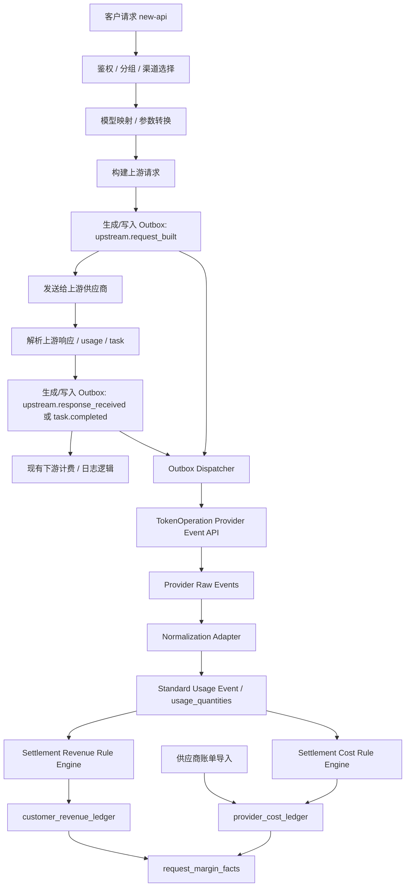

# 上游供应商成本核算 Outbox 事件系统 PRD

## 1. 背景

new-api 当前的模型定价、分组倍率、用量日志和 quota 扣费主要服务于下游客户计费。它回答的是“客户应该被收多少钱”，不是“调用上游供应商实际花了多少钱”。

随着接入更多供应商和异步任务类模型，单纯依赖下游计费日志无法准确计算上游成本，典型原因包括：

- 不同供应商的 usage 字段不同，例如 cache、图片、音频、视频 token 字段差异较大。
- 视频、音乐、图片生成等异步任务在 submit 阶段和 completed 阶段的信息不完整。
- 同一个客户模型名可能通过模型映射打到不同上游模型。
- 上游价格可能按区域、渠道、分辨率、时长、素材类型、任务状态、折扣协议动态变化。
- 下游模型定价可能是销售价，上游成本价可能来自供应商官方价、折扣价或账单导入价。

因此需要新增一套独立的上游成本核算能力：new-api 负责产生可靠事实事件，TokenOperation 运营平台负责原始事件入站、用量标准化、结算、毛利计算和对账。

## 2. 目标

- 在不改变现有下游计费语义的前提下，准确记录每次请求实际命中的上游供应商、渠道、模型、请求参数、响应 usage 和任务状态。
- 通过 Outbox 事件机制可靠地把上游调用事实传递给成本计算服务。
- 支持像“分组与模型定价设置”一样配置上游供应商成本规则，但成本规则与客户销售价完全分离。
- 支持按渠道、供应商、上游模型、客户模型、分辨率、规格、时长、token 类型、任务状态、生效时间和币种计算成本。
- 支持生成上游成本明细、客户收入与上游成本对账、毛利统计。
- 将成本配置、收入换算、毛利计算集中在 TokenOperation 运营平台中，减少与 new-api 的配置耦合。
- 将 new-api 侧改造收敛为“事实事件采集 + outbox + dispatcher”，不在 new-api 中新增上游成本规则或金额计算。
- 支持供应商官方账单导入，对实时事件计算结果进行校准。

## 3. 非目标

- 不替代现有客户扣费逻辑。
- 不在客户请求链路中同步等待 TokenOperation 返回。
- 不默认保存完整 prompt、Authorization、API key、cookie 等敏感信息。
- 不要求第一期覆盖所有供应商和所有 relay 类型。
- 不把上游成本规则复用为下游客户价格规则，两者只共享表达式能力和 UI 交互思路。

## 4. 用户角色

- 系统管理员：配置上游成本规则、查看成本明细、处理失败事件。
- 财务/运营：查看收入、成本、毛利、供应商账单差异。
- 开发/运维：排查事件投递、成本计算异常、供应商 usage 字段映射问题。

## 5. 核心概念

### 5.1 下游价格

下游价格是客户调用 new-api 时被收取的价格，当前由 `ModelPrice`、`ModelRatio`、`GroupRatio`、`billing_expr` 等配置决定。

### 5.2 上游成本

上游成本是 new-api 调用供应商产生的实际成本。它应该基于上游渠道、上游模型、供应商原始 usage、请求规格和供应商协议价格计算。

### 5.3 Outbox 事件

Outbox 事件是 new-api 产生的上游调用事实事件。事件最终需要进入本地 outbox 存储，再由异步 dispatcher 投递给 TokenOperation 的 provider event 入站接口。为了减少大模型 API 调用链路耗时，事件写入不要求所有场景都在请求线程内同步落库；系统应支持同步落库、内存队列批量落库和混合模式。客户请求不依赖事件投递成功，也不在请求链路中同步调用 TokenOperation。

### 5.4 成本规则

成本规则用于把一条或多条上游事件转换为成本明细。规则可以是固定单价、按 token 单价、按任务规格、按表达式或按官方账单覆盖。

## 6. 总体架构



设计边界：

- new-api 负责捕获事实、按写入模式进入 outbox、异步投递；不保存上游成本规则，不计算上游成本或毛利。
- TokenOperation 负责 provider raw event 入站、usage normalization adapter、成本规则、价格本、收入换算规则、汇率、账单导入、成本/收入 ledger 和毛利报表。
- 成本计算失败不能影响客户请求成功率。
- outbox 事件写入不能成为大模型 API 的强阻塞中间环节；默认应采用混合写入模式控制延迟。

TokenOperation 应作为相对独立的系统设计。它不直接读取 new-api 数据库中的模型价格、分组倍率或渠道配置，而是通过事件契约接收必要事实，并在自身系统内维护用量标准化配置、成本配置、收入换算配置和对账状态。new-api 是事实来源，TokenOperation 是用量标准化、结算和财务核算系统。

## 7. 功能需求

### 7.1 Outbox 事件采集

new-api 需要在以下生命周期点写入事件：

| 事件类型 | 场景 | 说明 |
| --- | --- | --- |
| `upstream.request_built` | 上游请求构建完成 | 记录真实上游 method、path、query、body 摘要、模型映射结果 |
| `upstream.request_failed` | 发送前或发送中失败 | 记录错误类型、渠道、模型、耗时 |
| `upstream.response_received` | 收到同步响应 | 记录 HTTP 状态码、上游 request id、响应 usage、耗时 |
| `upstream.response_failed` | 上游返回错误或解析失败 | 记录状态码、错误码、错误消息 |
| `task.submit_request` | 异步任务提交前 | 记录任务请求参数，例如视频时长、分辨率、素材 ID |
| `task.submit_response` | 异步任务提交成功 | 记录 public task id、upstream task id、提交响应 |
| `task.poll_response` | 异步任务轮询结果 | 可配置是否记录每次 poll，默认只记录状态变化 |
| `task.completed` | 异步任务成功完成 | 记录最终状态、结果 usage、视频/音频/图片实际规格 |
| `task.failed` | 异步任务失败 | 记录失败原因、是否应计成本 |
| `billing.downstream_delta` | 下游计费发生变化 | 统一记录预扣费、结算、退款、差额调整等 quota delta，用于收入 ledger |
| `billing.downstream_settled` | 下游计费完成 | 兼容型事件；也可作为 `billing.downstream_delta` 且 `billing_stage=settle` 处理 |

### 7.2 事件字段

Outbox 事件必须包含足够的归因字段：

```text
id
event_id
event_type
status
request_id
upstream_request_id
task_id
upstream_task_id
user_id
token_id
token_name
group
channel_id
channel_type
channel_name
origin_model_name
upstream_model_name
relay_mode
relay_format
is_stream
is_model_mapped
method
path
query
upstream_base_url
status_code
success
error_code
error_message
duration_ms
request_headers_json
request_body_json
request_body_hash
request_metadata_json
response_headers_json
response_body_json
response_body_hash
response_metadata_json
usage_json
raw_usage_json
extra_json
occurred_at
created_at
delivered_at
delivery_attempts
next_retry_at
last_delivery_error
```

字段在成本计算中的意义如下：

| 字段 | 成本计算意义 |
| --- | --- |
| `id` | outbox 本地自增主键，只用于本地扫描、锁定、重试和排障；不参与成本公式。 |
| `event_id` | 全局幂等键，TokenOperation 用它防止重复事件导致重复入账。 |
| `event_type` | 决定事件代表的生命周期阶段，例如请求提交、响应返回、任务完成、下游结算；TokenOperation 据此决定是否标准化、结算或只做关联。 |
| `status` | outbox 投递状态，例如 `pending`、`delivering`、`delivered`、`retrying`、`dead`；不参与成本公式，但影响事件是否已经进入 TokenOperation。 |
| `request_id` | new-api 单次客户请求的主链路 ID，用于把上游请求、下游扣费日志、错误日志和成本明细关联起来。 |
| `upstream_request_id` | 供应商返回的请求 ID，用于和供应商控制台、官方账单、故障工单对账。 |
| `task_id` | new-api 对外暴露的任务 ID，是异步视频、音乐、图片任务归因的主键。 |
| `upstream_task_id` | 供应商真实任务 ID，用于轮询结果、匹配供应商账单、排查上游任务。 |
| `user_id` | 成本归属到具体用户，用于按客户统计成本、收入、毛利。 |
| `token_id` | API Key 在 new-api `tokens` 表中的数据库 ID，不是 API Key 明文；用于把成本归属到具体 key，并计算每个 key 的成本和利润。 |
| `token_name` | 展示字段，方便管理员在成本明细和报表中识别 key；不建议作为唯一归因依据。 |
| `group` | 成本和收入按分组汇总时使用，也可用于区分 distributor、VIP、内部测试等业务场景。 |
| `channel_id` | 最精确的供应商成本规则匹配条件；同一模型在不同渠道可能有不同协议价。 |
| `channel_type` | 渠道类型维度，用于供应商级默认规则，例如 Volcengine、OpenAI、Claude、Gemini。 |
| `channel_name` | 展示和排障字段，辅助识别具体渠道；规则匹配应优先使用 `channel_id`。 |
| `origin_model_name` | 下游客户请求的模型名，用于收入侧关联，也可作为成本规则兜底匹配条件。 |
| `upstream_model_name` | 模型映射后的真实上游模型名，是计算供应商成本的核心字段。 |
| `relay_mode` | new-api 内部业务路由/能力类型，区分 chat、image、audio、embedding、video task、task fetch 等请求类型，决定生命周期、成本维度和是否需要异步归因。 |
| `relay_format` | 请求/响应协议和 DTO 格式，例如 OpenAI、Claude、Gemini、OpenAI Responses；用于判断上游 usage 字段语义、转换路径和 token 归一化方式。 |
| `is_stream` | 标记是否流式请求；流式请求通常要从最终 chunk 或聚合结果中提取 usage。 |
| `is_model_mapped` | 标记是否发生模型映射；对账时可解释客户模型和上游模型不一致的情况。 |
| `method` | 上游 HTTP 方法，用于区分创建、查询、删除、素材上传等接口。 |
| `path` | 上游接口路径，是素材库、人像库、任务查询等非模型接口成本规则的重要匹配条件。 |
| `query` | 上游 query 参数，部分供应商把版本、动作、beta 能力或 task id 放在 query 中。 |
| `upstream_base_url` | 上游基础地址，用于区分国内、海外、代理商、私有部署等不同成本来源。 |
| `status_code` | 上游 HTTP 状态码，用于判断请求是否成功、失败请求是否需要计成本。 |
| `success` | TokenOperation 的快速判断字段；例如仅成功任务计费时必须依赖它或最终 task 状态。 |
| `error_code` | 上游或 new-api 归一化后的错误码，用于分析失败成本、过滤不计费失败。 |
| `error_message` | 排障和人工对账字段，不进入公式，但能解释为什么某条成本为 0 或处于冲突状态。 |
| `duration_ms` | 请求耗时，可用于性能报表；对少数按运行时长计费的接口也可作为成本输入。 |
| `request_headers_json` | 脱敏且白名单化的请求头；用于读取 beta、region、版本、特殊能力开关等影响成本的字段。 |
| `request_body_json` | 可选保存的脱敏上游请求体；默认不保存完整 body，仅在指定渠道、短保留和审计开关下启用。 |
| `request_body_hash` | 原始请求体哈希，用于证明事件对应的请求未被篡改，也可在不保存 raw body 时做排障关联。 |
| `request_metadata_json` | 从请求中提取出的成本相关结构化字段，例如 duration、resolution、size、quality、asset_id，不包含完整 prompt。 |
| `response_headers_json` | 脱敏且白名单化的响应头；用于读取供应商 request id、ratelimit、计费相关 header。 |
| `response_body_json` | 可选保存的脱敏响应体；默认不保存完整响应正文，仅保留 usage、task、asset 等必要字段或 excerpt。 |
| `response_body_hash` | 原始响应体哈希，用于对账和排障，避免长期保存完整响应体。 |
| `response_metadata_json` | 从响应中提取出的成本相关结构化字段，例如 output_count、task_status、result_count、finish_reason。 |
| `usage_json` | new-api 归一化后的 usage，适合通用 token 成本计算和跨供应商报表；它由 `raw_usage_json` 或供应商响应转换而来，不保证能反向还原所有供应商字段。 |
| `raw_usage_json` | 供应商原始 usage 或一对一可还原字段，是准确计算 cache、图片、音频、视频、Claude/Gemini 特殊字段的优先依据；TokenOperation 应优先使用它。 |
| `extra_json` | 扩展字段，由事件采集点按场景赋值，用于存储 task 状态、matched action、素材类型、分辨率归一化结果、成本解析器中间值等。 |
| `occurred_at` | 事件真实发生时间，用于匹配成本规则的生效时间和供应商账单周期。 |
| `created_at` | outbox 记录创建时间，用于投递延迟、积压监控和事件保留清理。 |
| `delivered_at` | 事件成功投递到 TokenOperation 的时间，用于监控投递延迟；不参与成本公式。 |
| `delivery_attempts` | 投递尝试次数，用于判断事件可靠性和告警；不参与成本公式。 |
| `next_retry_at` | 下次重试时间，用于 dispatcher 调度；不参与成本公式。 |
| `last_delivery_error` | 最近一次投递失败原因，用于排障；不参与成本公式。 |

TokenOperation 在标准化和结算时应优先使用字段的顺序：

1. 用 `event_id` 做幂等，用 `request_id` / `task_id` / `upstream_task_id` 做链路关联。
2. 用 `channel_id`、`channel_type`、`upstream_model_name`、`path` 匹配 TokenOperation 的 usage normalization profile、adapter 和成本/收入规则。
3. 用 Adapter/Mapping 按 `raw_usage_json`、`extra_json`、`request_metadata_json`、`response_metadata_json`、`usage_json` 的优先级提取标准 `usage_quantities` 和 `usage_attributes`。
4. 用 `occurred_at` 选择正确版本的价格规则。
5. 用 `billing.downstream_delta` / `billing.downstream_settled` 事件中的收入字段生成收入、成本、毛利对账。

#### 7.2.1 `event_id` 生成方法

`event_id` 的目标是幂等，而不是展示。TokenOperation 必须能用同一个 `event_id` 判断重复投递、dispatcher 重试、服务重启后的重复事件。

推荐格式：

```text
evt_ + base32(sha256(canonical_key))[0:26]
```

`canonical_key` 由稳定字段拼接，不包含 API key、prompt、图片 URL 等敏感数据。不同事件类型使用不同的稳定键：

| 事件类型 | canonical_key 建议 |
| --- | --- |
| 同步请求事件 | `node_name|request_id|retry_index|event_type|channel_id|upstream_model_name` |
| 异步任务提交前 | `node_name|task_id|event_type|channel_id|origin_model_name` |
| 异步任务提交后 | `node_name|task_id|event_type|channel_id|upstream_task_id` |
| 异步任务终态 | `node_name|task_id|upstream_task_id|event_type|task_status|finish_time` |
| 下游结算事件 | `node_name|request_id|task_id|event_type|token_id|quota_delta` |
| 轮询事件 | `node_name|task_id|upstream_task_id|event_type|task_status|poll_sequence` |

如果某些一次性诊断事件缺少稳定字段，可以使用 UUIDv7，但必须在事件创建时固定下来，后续投递重试不能重新生成。Outbox 表应对 `event_id` 建唯一索引。

#### 7.2.2 `status` 状态转换机制

`status` 是 outbox 投递状态，只描述事件从 new-api 到 TokenOperation 的投递生命周期，不表示上游任务状态。上游任务状态应放在 `extra_json.task_status` 或专门字段中。

状态定义：

| 状态 | 含义 |
| --- | --- |
| `pending` | 事件已进入 outbox，等待 dispatcher 投递。 |
| `delivering` | dispatcher 已领取事件并正在投递。 |
| `delivered` | TokenOperation 已成功接收并确认。 |
| `retrying` | 最近一次投递失败，等待下一次重试。 |
| `dead` | 超过最大重试次数或遇到不可重试错误，需要人工处理或手动重投。 |

转换矩阵：

| From | 触发条件 | To |
| --- | --- | --- |
| 无记录 | 同步落库成功，或异步队列 flush 成功 | `pending` |
| `pending` | dispatcher 成功领取事件 | `delivering` |
| `retrying` | `next_retry_at <= now` 且 dispatcher 成功领取事件 | `delivering` |
| `delivering` | TokenOperation 返回 2xx，且响应表示 accepted | `delivered` |
| `delivering` | 网络错误、5xx、429、超时，且 `delivery_attempts < max_retry` | `retrying` |
| `delivering` | 4xx 不可重试错误，或 `delivery_attempts >= max_retry` | `dead` |
| `delivering` | 进程崩溃或长时间未完成，超过 lease timeout 后被后台修复任务发现 | `retrying` |
| `dead` | 管理员手动重试 | `retrying` |
| `delivered` | 正常情况下不再转换 | `delivered` |

实现建议：

- 领取事件时用条件更新保证单实例领取，例如只允许 `pending/retrying` 且到达重试时间的记录变成 `delivering`。
- 每次实际投递应增加 `delivery_attempts`。
- `retrying` 使用指数退避写入 `next_retry_at`。
- 手动重试 dead 事件时保留原 `event_id`，不能生成新事件。

#### 7.2.3 `token_id`、`relay_mode` 与 `relay_format`

`token_id` 明确表示 API Key 的数据库 ID，即 `tokens.id`。它不是 API Key 明文，也不是 `sk-...` 字符串。事件中不应保存客户 API Key 明文；如需排障，应使用 `token_id`、`token_name` 或脱敏后的 key hash。

`relay_mode` 和 `relay_format` 不能合并成一个字段，原因是它们描述的是两个维度：

- `relay_mode` 描述“用户正在调用 new-api 的哪类能力”，例如聊天、embedding、图片生成、音频、视频任务提交、视频任务查询。它决定成本生命周期：同步一次完成，还是异步 submit + poll + completed。
- `relay_format` 描述“请求/响应最终按哪种协议格式处理”，例如 OpenAI、Claude、Gemini、OpenAI Responses。它决定 usage 字段语义和归一化方式。

需要两个字段的典型场景：

- 同一个 `relay_mode=chat` 可能打到 OpenAI、Claude、Gemini 三种不同 `relay_format`，usage 字段含义不同。
- 同一个 `relay_format=openai` 可能用于 chat、embedding、image 等多个 `relay_mode`，成本维度不同。
- 视频任务的 `relay_mode=video_task` 关注异步任务状态，而它的上游请求格式可能是 OpenAI-compatible，也可能是供应商原生格式。

#### 7.2.4 `usage_json` 与 `raw_usage_json` 的转换关系

设计原则：

- `raw_usage_json` 尽量保存供应商原始 usage，或保存与供应商字段一对一对应、可无损还原的字段。
- `usage_json` 保存 new-api 归一化后的 usage，用于通用报表和统一 token 计算。
- 转换方向是 `raw_usage_json -> usage_json`；默认不要求 `usage_json -> raw_usage_json` 可逆。
- TokenOperation 标准化上游用量时优先使用 `raw_usage_json`，只有缺失时才使用 `usage_json` 兜底。
- 如果某供应商的原始 usage 不能保存完整，需要在 `extra_json.raw_usage_lossless=false` 标记不可无损。

示例：Claude 原始 usage 可以保存为：

```json
{
  "provider": "claude",
  "format": "anthropic_messages",
  "usage": {
    "input_tokens": 1000,
    "output_tokens": 200,
    "cache_read_input_tokens": 300,
    "cache_creation_input_tokens": 50
  }
}
```

归一化后的 `usage_json` 可以是：

```json
{
  "prompt_tokens": 1350,
  "completion_tokens": 200,
  "total_tokens": 1550,
  "prompt_tokens_details": {
    "cached_tokens": 300
  },
  "cache_creation_input_tokens": 50,
  "source_format": "claude",
  "normalization_version": "v1"
}
```

在这个例子中，`usage_json` 方便跨供应商报表，`raw_usage_json` 才是 Claude 成本精算的优先来源。

#### 7.2.5 `extra_json` 赋值示例

`extra_json` 由事件采集点根据上下文显式赋值，不应成为随意塞字段的垃圾桶。建议只放成本计算、归因、排障需要但又不适合提升为顶层列的字段。

Seedance 视频任务提交事件可能写入：

```json
{
  "action": "video_generation",
  "cost_dimension": "video_token",
  "task_status": "SUBMITTED",
  "requested_duration_seconds": 5,
  "requested_resolution": "480p",
  "normalized_resolution": "480p/720p",
  "aspect_ratio": "1:1",
  "asset_ids": ["asset-xxx"],
  "raw_usage_lossless": true
}
```

异步任务完成事件可能写入：

```json
{
  "task_status": "SUCCESS",
  "finish_reason": "completed",
  "actual_duration_seconds": 5,
  "actual_resolution": "480p",
  "result_url_count": 1,
  "should_count_cost": true
}
```

下游结算事件可能写入：

```json
{
  "downstream_quota": 3500000,
  "billing_source": "wallet",
  "pre_consumed_quota": 3500000,
  "actual_quota": 3500000,
  "price_model": "model_price",
  "other_ratios": {
    "duration": 5,
    "resolution": 1
  }
}
```

实现代码中可以类似这样构造，最终仍通过项目统一 JSON 工具写入 TEXT 字段：

```go
extra := map[string]any{
    "action":                     info.Action,
    "cost_dimension":             "video_token",
    "task_status":                string(task.Status),
    "requested_duration_seconds": request.Duration,
    "requested_resolution":       request.Resolution,
    "normalized_resolution":      normalizeSeedanceResolution(request.Resolution),
    "aspect_ratio":               request.Ratio,
    "asset_ids":                  request.AssetIDs,
    "raw_usage_lossless":         true,
}
```

#### 7.2.6 new-api 到 TokenOperation 的 Provider Event 契约

new-api 不直接调用现有 `/api/v1/gateway/usage-events`，因为该接口接收的是已经标准化的 `usage_quantities`。new-api 应新增 outbox dispatcher，投递到 TokenOperation 的 provider raw event 入站接口，例如：

```text
POST /api/v1/gateway/provider-events
POST /api/v1/gateway/provider-events/bulk
```

推荐事件 payload：

```json
{
  "source_system": "new-api:nexus-sg-prod",
  "event_id": "evt_01HX...",
  "event_type": "task.completed",
  "occurred_at": "2026-07-05T12:00:00Z",
  "request_id": "20260705120000...",
  "task_id": "task_xxx",
  "upstream_task_id": "vgt-xxx",
  "customer_context": {
    "gateway_customer_id": "user_123",
    "gateway_user_id": "123",
    "token_id": "456",
    "api_key_fingerprint": "sha256:...",
    "api_key_last4": "abcd",
    "group": "default"
  },
  "routing_context": {
    "channel_id": "18",
    "channel_type": "volcengine",
    "channel_name": "seedance-overseas",
    "model_name": "doubao-seedance-2-0-filter-off",
    "origin_model_name": "doubao-seedance-2-0-filter-off",
    "upstream_model_name": "doubao-seedance-2-0-filter-off",
    "call_type": "video_generation",
    "relay_mode": "video_task",
    "relay_format": "openai_compatible",
    "method": "POST",
    "path": "/v1/video/generations",
    "upstream_base_url": "https://..."
  },
  "usage_context": {
    "raw_usage_json": {},
    "usage_json": {},
    "request_metadata_json": {
      "duration": 5,
      "resolution": "480p",
      "aspect_ratio": "1:1"
    },
    "response_metadata_json": {
      "task_status": "succeeded",
      "result_count": 1
    },
    "extra_json": {
      "usage_quality_hint": "derived"
    }
  },
  "payload_hashes": {
    "request_body_hash": "sha256:...",
    "response_body_hash": "sha256:..."
  }
}
```

关键约束：

- `token_id` 是 new-api `tokens.id`，不是 `sk-...` 明文。
- `source_system + event_id` 是 TokenOperation 入站幂等键。
- `call_type` 必须使用 TokenOperation 与官方价、客户价、供应商成本规则共享的一套字典。
- `raw_usage_json` 应尽量来自供应商官方 API 原始 usage 字段；如果只拿到 OpenAI-compatible 转换后的 usage，必须在 `extra_json` 或 `normalization_evidence` 中标记来源。
- `model_name + call_type` 负责匹配官方价基准，`routing_context.channel_id` 负责决定向哪个上游供应商归属成本。

#### 7.2.7 TokenOperation 标准化产物

TokenOperation 接收到 provider raw event 后，先写入 `provider_raw_events`，状态建议为：

| 状态 | 触发条件 |
| --- | --- |
| `queued` | provider event 幂等落库成功，等待 adapter 标准化。 |
| `normalizing` | adapter worker 已领取事件。 |
| `normalized` | 已产出标准 usage event，并进入 settlement。 |
| `exception_blocked` | adapter 无法确定语义、metric 重叠、缺价格匹配字段或命中歧义，禁止静默按 0 结算。 |
| `ignored_non_billable` | 确认该事件不产生计费事实，例如仅状态轮询、失败且供应商明确不收费；必须保存 reason 和 evidence。 |

adapter 输出标准 usage fact，并进入现有 settlement：

```json
{
  "raw_event_id": "pre_123",
  "adapter_key": "claude_messages",
  "adapter_version": "v1",
  "usage_quality": "official",
  "usage_quantities": [
    { "metric_code": "input_tokens", "quantity": "1000" },
    { "metric_code": "output_tokens", "quantity": "200" },
    { "metric_code": "cache_read_tokens", "quantity": "300" }
  ],
  "usage_attributes": {
    "model_name": "claude-3-5-sonnet",
    "call_type": "chat_completion"
  },
  "normalization_evidence": {
    "raw_paths": {
      "input_tokens": "$.usage.input_tokens",
      "cache_read_tokens": "$.usage.cache_read_input_tokens"
    },
    "notes": "Claude official usage fields"
  }
}
```

`usage_quality` 语义：

- `official`：来自供应商官方 usage 或官方明确的计费字段，可进入 confirmed ledger。
- `derived`：由供应商规则、请求规格或任务终态确定性推导，例如视频按完成任务的 duration/resolution 计费，可入账但需保留 derived 标记。
- `estimated`：OpenAI-compatible fallback、字段缺失或语义不完整时的估算；默认不能直接生成 confirmed 财务 ledger，应进入异常、预览或人工确认流程。

### 7.3 敏感数据策略

事件体保存模式支持三档：

| 模式 | 说明 | 默认 |
| --- | --- | --- |
| `metadata` | 只保存成本相关结构化字段，不保存原始 body | 是 |
| `redacted` | 保存脱敏后的请求/响应 excerpt | 否 |
| `raw` | 保存完整原始请求/响应 body，仅限指定渠道或模型 | 否 |

默认脱敏规则：

- 删除 `Authorization`、`api-key`、`x-api-key`、`cookie`。
- prompt 默认不完整保存，可配置为 hash、截断或保留。
- 图片、音频、视频 URL 可配置为完整保存、域名保存或 hash。
- 保留成本关键字段：`model`、`duration`、`seconds`、`resolution`、`size`、`ratio`、`aspect_ratio`、`n`、`usage`、`input_tokens`、`output_tokens`、`cache`、`image`、`audio`、`task_id`、`asset_id`。

### 7.4 Outbox 写入模式与延迟控制

为了尽可能减少大模型 API 调用的中间环节耗时，Outbox 写入需要支持多种模式。默认生产建议使用混合模式，而不是所有事件都同步写数据库。

| 模式 | 说明 | 优点 | 风险 | 适用场景 |
| --- | --- | --- | --- | --- |
| 可靠优先 | 请求链路同步写本地 outbox 表 | 事件最可靠，进程崩溃不易丢失 | 每个事件增加一次 DB insert 延迟 | 高价值视频任务、异步任务终态、下游结算事件 |
| 性能优先 | 请求链路写入内存队列，由后台 goroutine 批量落库 | 对 API 延迟影响最小 | 进程异常退出时可能丢失尚未 flush 的事件 | 高频低成本 chat、embedding、非关键 request_built 事件 |
| 混合模式 | 按事件重要性选择同步或异步批量落库 | 平衡准确性和延迟 | 实现和配置略复杂 | 推荐生产默认模式 |

默认建议：

```text
task.submit_response        同步落库
task.completed              同步落库
task.failed                 同步落库
billing.downstream_delta    同步落库
billing.downstream_settled  同步落库
upstream.request_built      异步批量落库
upstream.response_received  异步批量落库
upstream.response_failed    异步批量落库
```

同步落库只允许做轻量 insert，不允许做成本计算、HTTP webhook、供应商账单查询或复杂 JSON 解析。同步落库应设置短超时，例如 `50ms` 或 `100ms`；超时后按配置降级为内存队列或记录本地错误日志。

异步批量落库要求：

- 请求链路只把已经脱敏和裁剪后的事件对象写入内存 channel。
- 后台 worker 按条数或时间 flush，例如每 `100` 条或每 `1s` 批量 insert。
- 队列必须有最大长度，避免成本事件堆积拖垮主服务。
- 队列满时按事件优先级处理：优先保留 `task.completed`、`task.failed`、`billing.downstream_delta`、`billing.downstream_settled`，允许丢弃低优先级 `upstream.request_built`。
- 被丢弃的事件必须计数并告警，例如 `outbox_dropped_count`。
- 大 body 不进入内存队列，只保存 hash 和成本字段。

推荐新增配置：

```text
UPSTREAM_EVENT_WRITE_MODE=hybrid
UPSTREAM_EVENT_SYNC_TIMEOUT_MS=100
UPSTREAM_EVENT_ASYNC_QUEUE_SIZE=10000
UPSTREAM_EVENT_ASYNC_FLUSH_INTERVAL_MS=1000
UPSTREAM_EVENT_ASYNC_FLUSH_BATCH_SIZE=100
UPSTREAM_EVENT_DROP_LOW_PRIORITY_WHEN_FULL=true
```

事件优先级建议：

| 优先级 | 事件 |
| --- | --- |
| P0 | `billing.downstream_delta`、`billing.downstream_settled`、`task.completed`、`task.failed` |
| P1 | `task.submit_response`、`upstream.response_received`、`upstream.response_failed` |
| P2 | `task.submit_request`、`upstream.request_built`、`task.poll_response` |

如果未来对强一致性要求更高，可以对指定渠道或模型启用可靠优先模式：

```text
UPSTREAM_EVENT_RELIABLE_CHANNEL_IDS=12,18
UPSTREAM_EVENT_RELIABLE_MODEL_PATTERNS=doubao-seedance-*,claude-opus-*
```

### 7.5 Dispatcher 投递

new-api 内部启动异步 dispatcher：

- 定时扫描 `pending` / `retrying` 事件。
- 批量投递到 TokenOperation provider event API。
- 投递成功标记为 `delivered`。
- 投递失败按指数退避重试。
- 超过最大重试次数标记为 `dead`。
- 支持手动重投 dead 事件。

推荐配置：

```text
UPSTREAM_EVENT_ENABLED=true
UPSTREAM_EVENT_WEBHOOK_URL=https://token-operation.example.com/api/v1/gateway/provider-events/bulk
UPSTREAM_EVENT_WEBHOOK_SECRET=***
UPSTREAM_EVENT_BATCH_SIZE=100
UPSTREAM_EVENT_MAX_RETRY=10
UPSTREAM_EVENT_BODY_MODE=redacted
UPSTREAM_EVENT_RETENTION_DAYS=30
```

Webhook 必须加签：

```text
X-New-Api-Event-Id
X-New-Api-Event-Type
X-New-Api-Event-Timestamp
X-New-Api-Event-Signature
```

签名规则：

```text
HMAC_SHA256(secret, timestamp + "." + request_body)
```

## 8. 上游供应商成本设置

### 8.1 设计原则

上游成本设置应借鉴当前模型定价设置的能力，但保持独立；用量标准化配置应先于成本规则配置：

- 下游模型定价用于“向客户收费”。
- 上游供应商成本用于“计算供应商成本”。
- 两者可以使用相似的固定价格、表达式、阶梯价和批量编辑 UI。
- 两者的存储、权限、审计和生效逻辑必须分开。
- 上游成本、收入换算、汇率、供应商账单导入和毛利报表配置都应放在 TokenOperation 中，new-api 只负责发送事实事件。
- TokenOperation 可以保存从事件中得到的用户、API Key、渠道、模型快照，但不应依赖直接读取 new-api 主库来完成成本或毛利计算。
- 不应把所有供应商强行转换成 OpenAI-compatible usage 后再计费；应保留供应商原始 usage 相关字段，并通过 usage normalization profile、adapter、usage metric 字典和现有 settlement 完成核算。

### 8.2 设置入口

建议新增菜单：

```text
TokenOperation 控制台 -> 上游成本设置
```

如果未来需要从 new-api 管理界面跳转，可只提供外链入口，不在 new-api 内保存成本配置：

```text
渠道详情 -> TokenOperation 成本规则
```

页面建议包含九个 Tab：

| Tab | 用途 |
| --- | --- |
| 用量标准化 | 配置 usage normalization profile、adapter 选择、usage metric 字典和字段提取预览 |
| 成本规则 | 配置模型/渠道/供应商成本规则 |
| 收入规则 | 配置 quota 到金额的换算、订阅收入分摊、内部组收入策略 |
| 价格本 | 管理供应商官方价、协议价、折扣价 |
| 成本明细 | 查看每次请求或任务计算出的上游成本 |
| 收入明细 | 查看下游 billing delta 形成的客户侧收入 ledger |
| 对账报表 | 对比下游收入、上游成本、供应商账单 |
| 毛利报表 | 查看实时估算毛利、任务完成毛利、账单校准毛利 |
| 事件投递 | 查看 outbox 投递状态、dead 事件和重试 |

### 8.3 用量标准化 Profile

TokenOperation 不应把所有供应商强行转成 OpenAI usage 后再计算成本。它需要先识别供应商、API 家族和原生格式，再选择用量标准化 adapter。adapter 只输出标准用量事实，不计算金额。

`usage_normalization_profiles` 字段建议：

```text
profile_id
provider
provider_display_name
api_family
native_format
region
default_currency
default_unit
adapter_key
adapter_version
metric_mapping_id
default_usage_quality
enabled
notes
```

字段说明：

| 字段 | 说明 |
| --- | --- |
| `provider` | 供应商标识，例如 `anthropic`、`volcengine`、`google`、`openai`、`azure`。 |
| `api_family` | API 能力族，例如 `chat`、`embedding`、`image`、`audio`、`video`、`asset`、`real_person`。 |
| `native_format` | 供应商原生请求/响应格式，例如 `claude_messages`、`gemini_generate_content`、`seedance_video_task`、`openai_compatible_basic`。 |
| `region` | 区域，例如 `global`、`cn`、`overseas`，用于区分官方价和协议价。 |
| `adapter_key` | 代码适配器名称，例如 `claude_messages`、`gemini_generate_content`、`seedance_video_task`；复杂供应商格式由 adapter 解析为标准用量事实。 |
| `adapter_version` | adapter 版本，用于回放、重算和审计。 |
| `metric_mapping_id` | 可配置字段映射 ID；简单供应商差异可用 mapping 补充，但不得让 mapping 直接算金额。 |
| `default_usage_quality` | 默认用量质量：`official`、`derived` 或 `estimated`。 |

示例：

```yaml
provider: anthropic
api_family: chat
native_format: claude_messages
region: global
adapter_key: claude_messages
adapter_version: v1
default_usage_quality: official
```

```yaml
provider: volcengine
api_family: video
native_format: seedance_video_task
region: overseas
adapter_key: seedance_video_task
adapter_version: v1
default_usage_quality: derived
```

### 8.4 Adapter、Mapping 与标准 Usage Metrics

成本计算应分两步：先把供应商原始事件标准化为 TokenOperation 标准 usage event，再由现有 settlement 使用官方价、供应商折扣、客户定价、汇率和账期规则计算金额。

字段来源优先级：

```text
raw_usage_json
extra_json
request_metadata_json
response_metadata_json
usage_json
```

不应默认保存完整 `request_body_json` / `response_body_json`。raw event 默认只保存 usage 相关字段、routing/task metadata、payload hash、必要的脱敏 excerpt 和 `adapter_evidence.raw_paths`。

平台级 `usage_metric` 字典需要维护不可重叠的原子计费量，避免 input token 同时包含已经单独计费的 cache、audio、image 或 video 量。字段建议：

```text
metric_code
display_name
atomic_definition
quantity_dimension
default_precision
is_billable
allow_as_official_price_component
notes
```

标准 usage metrics 建议覆盖：

```text
input_tokens
output_tokens
cache_read_tokens
cache_write_tokens
cache_write_1h_tokens
image_input_tokens
image_output_tokens
audio_input_tokens
audio_output_tokens
video_tokens
image_count
asset_count
session_count
duration_seconds
resolution
size
quality
status
model
region
```

简单供应商可通过 JSONPath/gjson 风格 mapping 配置：

```yaml
provider: anthropic
native_format: claude_messages
metrics:
  input_tokens: raw_usage_json.usage.input_tokens
  output_tokens: raw_usage_json.usage.output_tokens
  cache_read_tokens: raw_usage_json.usage.cache_read_input_tokens
  cache_write_tokens: raw_usage_json.usage.cache_creation_input_tokens
```

Seedance 示例：

```yaml
provider: volcengine
native_format: seedance_video_task
metrics:
  model: upstream_model_name
  duration_seconds: request_metadata_json.duration || request_metadata_json.seconds || extra_json.actual_duration_seconds
  resolution: request_metadata_json.resolution || extra_json.actual_resolution
  status: extra_json.task_status
  video_tokens: raw_usage_json.usage.total_tokens
```

图片生成示例：

```yaml
provider: openai
api_family: image
metrics:
  image_count: request_metadata_json.n || response_metadata_json.output_count
  size: request_metadata_json.size
  quality: request_metadata_json.quality
```

复杂供应商规则应使用“Adapter + 配置”：

- Adapter 负责理解供应商原生格式，处理字段嵌套、流式聚合、异步任务终态、特殊 usage 语义，并输出 `usage_quantities`、`usage_attributes`、`normalization_evidence`。
- Mapping 负责把常规字段映射为 metrics 或 attributes。
- 成本规则和价格本仍然配置化，避免把价格写死在代码里。

### 8.5 成本规则列表

规则列表字段：

```text
规则名称
启用状态
供应商
渠道 ID / 渠道名称
渠道类型
客户模型名
上游模型名
计费方式
币种
单位价格
生效时间
失效时间
优先级
最近修改人
最近修改时间
```

筛选条件：

- 供应商
- 渠道
- 渠道类型
- 上游模型名
- 客户模型名
- 计费方式
- 启用状态
- 生效时间

### 8.6 成本规则编辑器

计费方式支持：

| 方式 | 适用场景 | 示例 |
| --- | --- | --- |
| 固定单价 | 每次请求固定成本 | 每次调用 0.01 USD |
| Token 单价 | 文本、embedding、多模态 token | input 3 USD/1M, output 15 USD/1M |
| 表达式计费 | cache、图片、音频、长上下文、复杂条件 | `tier("base", p * 3 + c * 15 + cr * 0.3)` |
| 任务规格计费 | 视频、音乐、图片生成 | 按 `duration`、`resolution`、`size` |
| 矩阵计费 | 模型 + 规格 + 质量组合 | `matrix_price(model, resolution, quality)` |
| 按秒计费 | 音频、视频、运行时长 | `duration_seconds * unit_price` |
| 按图片计费 | 图片数量、尺寸、质量 | `image_count * matrix_price(model, size, quality)` |
| 成功态计费 | 只有任务成功才计成本 | `status == "SUCCESS"` |
| 素材/资产计费 | 素材上传、人像库、真人认证 | 每个 asset 或 session 固定成本 |
| 账单覆盖 | 以供应商账单导入为最终成本 | 按 bill item 覆盖实时估算 |

编辑器字段：

```text
规则名称
启用状态
供应商
用量标准化 Profile
字段提取 Mapping
渠道匹配
模型匹配
成本维度
计费方式
币种
单位
单价
表达式
生效时间
失效时间
优先级
是否只在成功任务计费
是否允许账单导入覆盖
备注
```

### 8.7 规则匹配优先级

成本规则匹配应支持从精确到宽泛：

1. `channel_id + upstream_model_name + api_family + cost_dimension`
2. `channel_type + upstream_model_name + api_family + cost_dimension`
3. `provider + upstream_model_name + api_family + cost_dimension`
4. `provider + endpoint_path + cost_dimension`
5. `origin_model_name + cost_dimension`
6. `provider + model_pattern + api_family + cost_dimension`
7. 默认供应商规则

如果多条规则命中：

- 优先级高的规则胜出。
- 优先级相同则选择更精确的匹配。
- 生效时间必须覆盖事件发生时间。
- 规则冲突时在 UI 中提示。

### 8.8 表达式能力

上游成本表达式可以复用现有 `billingexpr` 思路，但需要独立命名空间，例如 `cost_expr`，避免和客户计费表达式混淆。

建议支持变量：

| 变量 | 含义 |
| --- | --- |
| `p` | 输入 token |
| `c` | 输出 token |
| `cr` | cache read token |
| `cc` | cache creation token |
| `cc1h` | 1h cache creation token |
| `img` | 图片输入 token 或图片数量 |
| `img_o` | 图片输出 token 或图片数量 |
| `ai` | 音频输入 token |
| `ao` | 音频输出 token |
| `duration` | 时长，单位秒 |
| `duration_seconds` | 时长，单位秒，推荐作为统一变量名 |
| `resolution` | 分辨率，例如 `480p`、`720p`、`1080p`、`4K` |
| `size` | 尺寸或规格 |
| `quality` | 图片或视频质量档位 |
| `status` | 任务状态 |
| `model` | 上游模型名或标准 usage attributes 中的模型标识 |
| `n` | 生成数量 |
| `image_count` | 图片数量 |
| `asset_count` | 素材数量 |
| `session_count` | 会话数量，例如真人认证 session |
| `video_tokens` | 视频 token 或供应商返回的视频计费量 |

建议支持函数：

| 函数 | 用途 |
| --- | --- |
| `param(path)` | 读取请求 metadata 字段 |
| `usage(path)` | 读取上游 usage 字段 |
| `task(path)` | 读取任务结果字段 |
| `meta(path)` | 读取事件 extra 字段 |
| `metric(name)` | 读取标准化后的 usage metric |
| `price(key)` | 从价格本读取单价 |
| `matrix_price(...)` | 按模型、规格、质量等维度读取矩阵价格 |
| `tier(name, value)` | 标记命中的成本档位 |
| `currency(amount, from, to)` | 按配置汇率换算 |

表达式示例：

```text
tier("text", p * 3 + c * 15)
```

```text
resolution == "1080p"
  ? tier("1080p", usage("total_tokens") * 7.7)
  : tier("base", usage("total_tokens") * 7)
```

```text
status == "SUCCESS"
  ? tier("video", duration * price("video_second"))
  : tier("failed", 0)
```

```text
status == "SUCCESS"
  ? tier("seedance", video_tokens * matrix_price(model, resolution) / 1000000)
  : tier("failed", 0)
```

```text
tier("image", image_count * matrix_price(model, size, quality))
```

### 8.9 价格本

价格本用于维护供应商官方价、协议价、折扣价，不直接产生成本明细。

价格本字段：

```text
供应商
区域
上游模型名
成本维度
规格
官方价
协议价
折扣率
币种
单位
生效时间
来源链接
备注
```

成本规则可以引用价格本：

```text
price("seedance.filter_off.1080p")
```

或在 UI 中选择“从价格本生成规则”。

### 8.10 供应商成本模板

管理员不应每次从零编写复杂表达式。TokenOperation 应提供供应商成本模板，模板包含 normalization profile、adapter/mapping、默认 usage metrics、表达式草稿和价格本字段。

建议内置模板：

| 模板 | 覆盖场景 |
| --- | --- |
| Anthropic Claude token/cache 模板 | input/output/cache read/cache write |
| OpenAI token/audio/image 模板 | chat、responses、audio、image |
| Gemini token/cache/thinking 模板 | 文本、多模态、thinking、cache |
| Seedance 视频分辨率模板 | 视频模型、时长、分辨率、任务成功态 |
| 图片生成 size/quality 模板 | 图片数量、尺寸、质量 |
| 素材库 per asset 模板 | 素材上传、人像库、真人认证 session |

配置流程：

1. 选择供应商和 API 类型。
2. 选择上游模型或模型通配符。
3. 选择计费模板。
4. 检查或调整字段映射。
5. 填写官方价格、协议价或折扣价。
6. 用样例事件试算。
7. 保存为版本化规则。

### 8.11 收入规则

收入规则用于把 new-api 的下游 `quota_delta` 转换为 TokenOperation 中的收入金额。TokenOperation 不应重新判断客户是否应该扣费，只消费 new-api 已经发生的 billing delta 事实。

收入规则字段建议：

```text
source_system
group
billing_source
quota_unit
base_currency
quota_per_unit
effective_from
effective_to
allocation_policy
notes
```

`billing_source` 示例：

| 来源 | 说明 | 收入处理建议 |
| --- | --- | --- |
| `wallet` | 客户余额扣费 | 按 quota delta 换算使用收入 |
| `subscription` | 订阅额度或套餐 | 按订阅收入分摊规则换算 |
| `internal` | 内部测试或自用 | 可配置收入为 0 |
| `manual_adjustment` | 人工调账 | 保留原始 delta，按调账规则处理 |

订阅收入不能简单等同于本次请求扣掉的 quota。TokenOperation 需要支持分摊策略：

- 按订阅月费 / 当月实际用量比例分摊。
- 按 quota 标价折算使用收入。
- 指定用户组或渠道收入记为 0。
- 指定 distributor group 使用单独收入换算规则。

### 8.12 Seedance 示例

Seedance 这类视频模型需要支持按模型和分辨率/规格设置成本。

示例规则：

| 上游模型 | 规格 | 成本维度 | 单位 | 单价 |
| --- | --- | --- | --- | --- |
| `doubao-seedance-2-0-filter-off` | `480p/720p` | video token | USD / 1M tokens | 7 |
| `doubao-seedance-2-0-filter-off` | `1080p` | video token | USD / 1M tokens | 7.7 |
| `doubao-seedance-2-0-filter-off` | `4K` | video token | USD / 1M tokens | 4 |
| `doubao-seedance-2-0-fast-filter-off` | `480p/720p` | video token | USD / 1M tokens | 5.6 |
| `dreamina-seedance-2-0-mini-filter-off` | `480p/720p` | video token | USD / 1M tokens | 3.5 |

如果供应商提供协议价或折扣价，应使用协议价作为成本，官方价作为参考字段。

规则编辑器应允许管理员配置：

```text
供应商: Volcengine Overseas
渠道: 世纪互联海外
上游模型: doubao-seedance-2-0-filter-off
成本维度: video_token
匹配字段: resolution
价格档位:
  - 480p/720p: 7 USD / 1M tokens
  - 1080p: 7.7 USD / 1M tokens
  - 4K: 4 USD / 1M tokens
仅成功任务计费: 是
允许账单导入覆盖: 是
```

## 9. 成本、收入和毛利明细

TokenOperation 根据 upstream provider raw event 标准化后的 usage fact 和成本规则生成 `provider_cost_ledger`，根据 downstream billing 事件和收入规则生成 `customer_revenue_ledger`，再按请求、任务、用户、API Key、渠道、模型等维度汇总为毛利事实。

### 9.1 上游成本 Ledger

`provider_cost_ledger` 字段建议：

```text
id
ledger_id
source_event_id
request_id
task_id
upstream_task_id
user_id
token_id
group
channel_id
channel_type
provider
origin_model_name
upstream_model_name
cost_dimension
matched_rule_id
matched_rule_version
matched_tier
quantity
unit
unit_price
currency
cost_amount
cost_amount_usd
cost_amount_cny
cost_status
calculated_at
created_at
```

`cost_status`：

```text
estimated
final
bill_verified
allocated_from_monthly_bill
conflict
ignored
```

### 9.2 客户收入 Ledger

`customer_revenue_ledger` 记录客户侧已经发生的用量收入事实。它不是充值流水，而是请求或任务消耗带来的收入确认。

字段建议：

```text
id
ledger_id
source_event_id
request_id
task_id
user_id
token_id
group
origin_model_name
upstream_model_name
billing_stage
billing_source
quota_delta
quota_total
quota_unit
quota_per_unit
base_currency
revenue_amount
revenue_amount_usd
revenue_amount_cny
revenue_status
pricing_snapshot_json
calculated_at
created_at
```

`billing_stage`：

```text
pre_consume
settle
refund
adjustment
```

`revenue_status`：

```text
estimated
settled
refunded
adjusted
allocated_subscription_revenue
ignored
```

收入计算原则：

- 钱包扣费场景下，收入一般按 `quota_delta` 和收入换算规则计算。
- 订阅场景下，收入应按订阅分摊规则计算，不应简单等同于 quota 消耗。
- 充值金额属于现金流入，不等同于单次请求收入；毛利分析应优先使用用量收入。
- 退款和差额调整必须以负向 ledger 记录，保持收入明细 append-only。

推荐 billing delta 事件 payload：

```json
{
  "event_type": "billing.downstream_delta",
  "request_id": "req_xxx",
  "task_id": "task_xxx",
  "user_id": 12,
  "token_id": 34,
  "group": "default",
  "origin_model_name": "doubao-seedance-2-0-fast-filter-off",
  "upstream_model_name": "doubao-seedance-2-0-fast-filter-off",
  "billing_stage": "settle",
  "billing_source": "wallet",
  "quota_delta": 3500000,
  "quota_total": 3500000,
  "pricing_snapshot": {
    "model_price": 7,
    "group_ratio": 1,
    "other_ratios": {
      "duration": 5,
      "resolution": 1
    }
  }
}
```

### 9.3 毛利事实

`request_margin_facts` 可以作为物化表，也可以由查询实时聚合。

字段建议：

```text
request_id
task_id
user_id
token_id
group
channel_id
origin_model_name
upstream_model_name
revenue_amount_usd
cost_amount_usd
gross_margin_usd
gross_margin_rate
revenue_status
cost_status
margin_status
calculated_at
```

毛利公式：

```text
gross_margin = customer_revenue - provider_cost
gross_margin_rate = gross_margin / customer_revenue
```

报表需要区分：

```text
实时估算毛利 = 已结算收入 - 实时估算成本
任务完成毛利 = 已结算收入 - 任务完成后成本
账单校准毛利 = 已结算收入 - 月度账单校准成本
```

## 10. 对账能力

对账报表至少支持：

- 按日、供应商、渠道、模型统计上游成本。
- 按用户、token、分组统计收入、成本、毛利。
- 对比实时估算成本与供应商账单导入成本。
- 标记账单差异超过阈值的请求或任务。
- 支持导出 CSV。

供应商账单导入需要按“月度汇总优先”设计。多数供应商正常情况下按自然月出账单，账单通常只有产品、区域、模型、用量、金额等汇总维度，不一定提供请求级或 task 级明细。因此：

- 默认账期为自然月，例如 `2026-07-01 00:00:00` 到 `2026-07-31 23:59:59`。
- `provider_bill_imports` 应记录账期月份、供应商账号、币种、账单总额、导入来源和导入时间。
- `provider_bill_import_items` 应记录供应商、区域、产品、模型、成本维度、汇总用量、汇总金额，而不是假设一定有 request id。
- 没有请求级账单明细时，不应强行把每条 `provider_cost_ledger` 标记为精确账单成本；应在月度/供应商/模型维度标记 `bill_verified`。
- 如果需要把月度账单分摊到请求级明细，应使用实时估算成本占比进行 allocation，并把明细状态标记为 `allocated_from_monthly_bill` 或在 `extra_json` 中记录分摊系数。
- 如果供应商少数情况下提供 request id、task id 或 upstream request id 级明细，才允许直接覆盖对应 ledger。

建议指标：

```text
请求数
成功请求数
失败请求数
下游扣费 quota
下游收入
上游估算成本
上游账单成本
毛利
毛利率
未匹配成本规则事件数
dead outbox 事件数
```

## 11. 数据表建议

### 11.1 new-api 主库

```text
upstream_event_outbox
```

用途：new-api 可靠落库和投递事件。

注意：

- JSON 字段使用 TEXT，兼容 SQLite、MySQL、PostgreSQL。
- 不使用数据库专属 JSONB、SKIP LOCKED 等能力。
- 锁定事件使用状态更新和 affected rows 实现。

### 11.2 TokenOperation 库

```text
collector_sources
provider_raw_events
usage_normalization_profiles
usage_metrics
metric_mappings
cost_rule_templates
provider_cost_rules
provider_cost_rule_versions
provider_price_books
revenue_conversion_rules
currency_rates
standard_usage_events
provider_cost_ledger
customer_revenue_ledger
request_margin_facts
provider_bill_imports
provider_bill_import_items
provider_cost_reconciliation_runs
```

`collector_sources` 用于登记不同 new-api 实例或未来其他 API 网关来源。TokenOperation 应通过 `source_system + event_id` 做全局幂等，避免多个来源事件 ID 碰撞。

`provider_raw_events` 用于保存 new-api 投递的原始 provider event，按 `source_system + event_id` 幂等，状态包括 `queued`、`normalizing`、`normalized`、`exception_blocked`、`ignored_non_billable`。

`usage_normalization_profiles`、`usage_metrics`、`metric_mappings` 和 adapter registry 用于把不同供应商的原生字段解析为标准 `usage_quantities` / `usage_attributes`。这层只做用量标准化，不计算金额。

`standard_usage_events` 是标准化后的用量事实，可以复用现有 settlement。它应保存 `raw_event_id`、`adapter_key`、`adapter_version`、`usage_quality`、`normalization_evidence` 和 `raw_paths`，便于审计和重放。

`revenue_conversion_rules` 和 `currency_rates` 由 TokenOperation 自己维护，用于把 new-api 的 quota delta 转换为基础币种收入，并保证历史规则按生效时间版本化。

`provider_bill_imports` 和 `provider_bill_import_items` 应按自然月汇总账单设计，不应假设供应商账单具备请求级明细。建议至少包含：

```text
billing_month
provider
provider_account
region
product
upstream_model_name
cost_dimension
usage_quantity
usage_unit
bill_amount
currency
source_file
imported_at
```

TokenOperation 推荐独立部署和独立数据库。为了部署便利，new-api 只需要携带 outbox 与 dispatcher，不建议把 TokenOperation 的成本规则、收入规则和权限边界混入 new-api 主库。

## 12. API 设计

### 12.1 new-api 内部管理 API

```text
GET  /api/upstream-events
GET  /api/upstream-events/:event_id
POST /api/upstream-events/:event_id/retry
POST /api/upstream-events/retry-dead
GET  /api/upstream-events/stats
```

### 12.2 TokenOperation API

```text
POST /api/v1/gateway/provider-events
POST /api/v1/gateway/provider-events/bulk
GET  /provider-raw-events
GET  /provider-raw-events/:id
POST /provider-raw-events/:id/reprocess
GET  /usage-normalization-profiles
POST /usage-normalization-profiles
PUT  /usage-normalization-profiles/:id
GET  /usage-metrics
POST /usage-metrics
PUT  /usage-metrics/:id
GET  /metric-mappings
POST /metric-mappings
PUT  /metric-mappings/:id
POST /metric-mappings/preview
GET  /cost-templates
GET  /cost-rules
POST /cost-rules
PUT  /cost-rules/:id
POST /cost-rules/:id/validate
POST /cost-rules/preview
GET  /price-books
POST /price-books
GET  /revenue-rules
POST /revenue-rules
PUT  /revenue-rules/:id
GET  /revenue-ledger
GET  /cost-ledger
GET  /cost-reports/summary
GET  /margin-reports/summary
POST /provider-bill-imports
GET  /reconciliation-runs
```

### 12.3 规则校验 API

规则编辑器需要提供试算能力：

```text
POST /metric-mappings/preview
POST /cost-rules/preview
```

`/metric-mappings/preview` 用样例 provider raw event 输出标准 `usage_quantities` 和 `usage_attributes`，帮助管理员确认供应商字段提取是否正确。`/cost-rules/preview` 用标准 usage fact 和成本规则输出成本金额。

输入：

```json
{
  "rule": {
    "billing_mode": "cost_expr",
    "expr": "tier(\"base\", p * 3 + c * 15)"
  },
  "event": {
    "usage_json": {
      "input_tokens": 1000,
      "output_tokens": 200
    }
  }
}
```

输出：

```json
{
  "matched": true,
  "matched_tier": "base",
  "quantity": 1,
  "currency": "USD",
  "cost_amount": 0.006
}
```

## 13. UI 需求

### 13.1 用量标准化页面

能力：

- 新建和维护 usage normalization profile。
- 配置 provider adapter，例如 `claude_messages`、`gemini_generate_content`、`seedance_video_task`、`openai_compatible_basic`。
- 维护 `usage_metric` 字典，确保 metric 是不可重叠的原子计费量。
- 配置字段提取 Mapping，把 raw usage、request/response metadata、extra 映射为标准 `usage_quantities` 和 `usage_attributes`。
- 上传样例 provider raw event，预览 adapter evidence、raw paths、usage quality 和异常原因。
- 将模板一键生成成本规则草稿。

### 13.2 成本规则页面

能力：

- 新建、编辑、复制、禁用成本规则。
- 批量导入上游模型成本。
- 按渠道或供应商批量应用规则。
- 查看规则匹配优先级。
- 试算规则。
- 查看规则版本历史。

交互参考当前模型定价设置：

- 支持固定价格编辑。
- 支持表达式/阶梯计费编辑。
- 支持可视化档位编辑。
- 支持 raw 表达式模式。
- 支持从上游价格本同步。

### 13.3 收入规则页面

能力：

- 配置 quota 到基础币种的换算规则。
- 配置钱包、订阅、内部测试、distributor 等不同收入策略。
- 配置订阅收入分摊策略。
- 按生效时间版本化收入规则。
- 试算 billing delta 转换后的收入金额。

### 13.4 价格本页面

能力：

- 录入供应商官方价。
- 录入协议折扣价。
- 维护币种和单位。
- 维护生效时间。
- 从 CSV 导入。
- 根据价格本生成成本规则。

### 13.5 成本、收入和毛利明细页面

能力：

- 按时间、用户、token、渠道、模型、任务 ID 查询。
- 展示下游 billing delta、收入金额、上游成本、毛利。
- 展示命中的成本规则和档位。
- 展示收入换算规则和订阅分摊结果。
- 展示原始事件摘要。
- 支持导出。

### 13.6 事件投递页面

能力：

- 查看 pending、retrying、delivered、dead 状态。
- 查看投递错误。
- 手动重试单条或批量事件。
- 查看事件脱敏后的 payload。

## 14. 非功能需求

### 14.1 可靠性

- 事件写入失败不能导致客户请求失败，除非显式配置为严格模式。
- Dispatcher 失败不能影响 relay 主流程。
- TokenOperation 重复收到同一事件必须幂等。
- TokenOperation 不应依赖直接读取 new-api 主库；跨系统数据交换以事件契约和账单导入为准。

### 14.2 性能

- 同步请求链路只允许做轻量事件构造；默认不在所有事件上强制同步数据库 insert。
- 不允许在客户请求链路中同步调用 TokenOperation。
- 不允许在客户请求链路中执行成本规则计算。
- 大 body 默认不完整入库，只保存 hash 和成本字段。
- 默认生产采用混合写入模式：关键事件同步短超时落库，普通事件内存队列批量落库。
- 内存队列必须有最大长度和低优先级丢弃策略，避免事件系统反向拖慢 relay 主流程。
- 同步落库超时应可降级，不应无限等待数据库。

### 14.3 安全

- webhook 使用 HMAC 签名。
- 管理页面需要管理员权限。
- raw body 保存必须有独立开关和审计记录。
- 敏感 header 永不保存。

### 14.4 可观测性

需要暴露：

```text
outbox_pending_count
outbox_dead_count
outbox_delivery_latency
outbox_delivery_failures
outbox_dropped_count
outbox_async_queue_depth
cost_rule_miss_count
cost_calculation_error_count
revenue_rule_miss_count
revenue_calculation_error_count
bill_reconciliation_diff_count
```

### 14.5 数据保留

建议默认：

- Outbox 原始事件保留 30 天。
- 成本明细长期保留。
- raw body 可单独设置更短保留周期，例如 7 天。

## 15. 实施阶段

### 阶段 1：事件契约与开关

new-api 侧：

- 定义 provider event DTO，字段与 TokenOperation provider-events API 对齐。
- 新增配置：

```text
UPSTREAM_EVENT_ENABLED=false
UPSTREAM_EVENT_SOURCE_SYSTEM=new-api:<deployment>
UPSTREAM_EVENT_WEBHOOK_URL=https://token-operation.example.com/api/v1/gateway/provider-events/bulk
UPSTREAM_EVENT_WEBHOOK_SECRET=***
UPSTREAM_EVENT_WRITE_MODE=hybrid
UPSTREAM_EVENT_BODY_MODE=metadata
UPSTREAM_EVENT_SYNC_TIMEOUT_MS=100
```

- 明确 `token_id=tokens.id`，只传 `api_key_fingerprint` 和 `api_key_last4`，不传 API Key 明文。
- 明确 `call_type` 字典来源，与 TokenOperation 的官方价、客户价、供应商成本规则共用。
- 默认只采集 `raw_usage_json`、`usage_json`、request/response metadata、payload hash 和必要 extra，不采集完整 prompt/response。

TokenOperation 侧：

- 新增 `provider-events` / `provider-events/bulk` 入站接口。
- 新增 `provider_raw_events` 幂等落库，幂等键为 `source_system + event_id`。
- 新增入站签名校验、schema 校验、字段脱敏校验和状态机。

### 阶段 2：new-api Outbox 与 Dispatcher

new-api 侧：

- 新增 `upstream_event_outbox` 表，兼容 SQLite、MySQL、PostgreSQL。
- 实现同步落库、内存队列批量落库、混合写入三种模式。
- 实现 dispatcher 批量投递、指数退避、dead event、手动重试和投递统计。
- 管理 API 提供 outbox 查询、重试、dead 重投和统计。
- 所有投递失败不影响客户请求，所有事件重投保持原 `event_id`。

TokenOperation 侧：

- 入站事件只负责 accepted，不在 HTTP 请求中同步做 adapter 标准化或 settlement。
- 后台 worker 从 `provider_raw_events` 拉取事件并标准化，避免反压 new-api。

### 阶段 3：同步请求原始 usage 采集

new-api 侧：

- 在 relay 收到上游响应后、转换为 OpenAI-compatible 或 dto.Usage 前，尽量捕获供应商官方原始 usage。
- 首批接入 Claude、OpenAI-compatible、Gemini 的同步文本/多模态响应。
- Claude 必须保留 `input_tokens`、`output_tokens`、`cache_read_input_tokens`、`cache_creation_input_tokens` 等官方字段。
- Gemini 必须保留 `usageMetadata`、modality、cached content、thinking/reasoning 等可影响成本的字段。
- OpenAI-compatible 事件需要标记来源；如果无法确认是官方语义，则在 TokenOperation 侧按 `estimated` 或 exception 处理。

TokenOperation 侧：

- 实现 `claude_messages` adapter。
- 实现 `openai_compatible_basic` adapter，但默认低置信，不自动进入 confirmed ledger，除非 profile 显式声明该上游格式语义等同官方 usage。
- 新增 `usage_metric` 字典种子，至少覆盖 input/output/cache/image/audio/video/request/task 类原子 metric。

### 阶段 4：异步任务与 Seedance 视频链路

new-api 侧：

- 在任务提交前后写入 `task.submit_request` 和 `task.submit_response`。
- 在任务查询或回调拿到终态时写入 `task.completed` / `task.failed`。
- 事件必须包含 public `task_id`、`upstream_task_id`、`channel_id`、`origin_model_name`、`upstream_model_name`、`duration`、`resolution`、`aspect_ratio`、`status`、素材 ID 等归因字段。
- 对 Seedance 视频优先保证完成态事件可靠落库；低价值 poll 事件默认只记录状态变化或不开启。

TokenOperation 侧：

- 实现 `seedance_video_task` adapter。
- 按模型、分辨率/规格、时长、任务成功状态产出 `usage_quantities` 和 `usage_attributes`。
- 如果供应商没有 request 级 usage，只能用任务规格确定性推导，标记 `usage_quality=derived`。

### 阶段 5：下游收入事件对接

new-api 侧：

- 在现有预扣费、结算、退款、差额调整路径写入 `billing.downstream_delta`。
- 事件至少包含 `quota_delta`、`pre_consumed_quota`、`actual_quota`、`billing_stage`、`token_id`、`user_id`、`group`、`request_id`、`task_id`、`model`、`call_type`、计费配置快照或可追溯 log id。
- 订阅、内部测试组、distributor group 等特殊收入策略只发送事实，不在 new-api 中计算毛利。

TokenOperation 侧：

- 复用现有 settlement，将 downstream billing delta 转为 `customer_revenue_ledger`。
- 在 TokenOperation 中配置 quota 到金额、订阅分摊、内部组和 distributor 收入规则。
- 毛利计算统一基于 `provider_cost_ledger` 与 `customer_revenue_ledger`。

### 阶段 6：异常修复、重放与对账

new-api 侧：

- 提供按时间、event type、request id、task id、token id、channel id 查询 outbox 的能力。
- 支持 dead event 手动重试，保证重试不生成新 `event_id`。
- 提供 shadow mode：只采集和投递，不影响现有计费报表。

TokenOperation 侧：

- Adapter 失败进入 `exception_blocked`，不静默算 0。
- 支持修复 profile、mapping、usage_metric 后 reprocess raw event。
- 重放同一 raw event 时不得重复结算；已生成 ledger 的事件必须走冲正或版本化重算流程。
- 支持供应商自然月汇总账单导入。正常情况下供应商只提供月度汇总时，按自然月、供应商、渠道、模型、成本维度做校准，不假设有请求级账单明细。

### 阶段 7：生产灰度与扩展供应商

- 先在生产开启 shadow mode，验证事件量、延迟、丢失率、TokenOperation 入站成功率。
- 对比 new-api 现有下游用量日志、TokenOperation 收入 ledger、供应商账单汇总。
- 第一批 provider adapter 顺序：Claude、Seedance completed-task、Gemini。
- 再扩展 OpenAI、Azure、AWS Bedrock、图片、音频、embedding、rerank、batch、streaming。
- 每个新 adapter 必须配样例 raw event、normalization evidence、异常用例和重放测试。

### 阶段 8：new-api 代码落点规划

new-api 侧建议按现有分层落地，避免把 TokenOperation 的规则引擎引入主服务：

| 模块 | 建议改造点 | 目的 |
| --- | --- | --- |
| `model` | 新增 `UpstreamEventOutbox` 模型和迁移，迁移接入 `model/main.go` 的现有 AutoMigrate 流程 | 本地可靠事件存储，兼容 SQLite/MySQL/PostgreSQL |
| `service` | 新增 `upstream_event` service，负责构造事件、脱敏、hash、同步/异步写入、dispatcher | 统一采集入口，业务层不用关心投递细节 |
| `controller` | 新增 outbox 管理 API；在 `controller/task_video.go` 的任务终态结算路径补齐任务完成/失败和下游 delta 事件 | 管理和重放事件，覆盖异步视频补扣/退款 |
| `relay` | 在 `relay/claude_handler.go`、`relay/responses_handler.go`、`relay/audio_handler.go`、`relay/image_handler.go`、`relay/rerank_handler.go` 等响应处理完成点发出 upstream response 事件 | 捕获上游原始 usage 和转换后的 dto.Usage |
| `relay/relay_task.go` | 在 `RelayTaskSubmit` 构建请求、收到 submit 响应、解析 upstream task id 后写入任务事件 | 连接 submit、upstream task id 和后续完成态 |
| `service/text_quota.go`、`service/quota.go`、`service/billing.go`、`service/task_billing.go` | 在现有扣费、预扣费、补扣费、退款处写入 `billing.downstream_delta` | 让 TokenOperation 能准确计算客户侧收入 |
| `dto` | 对 Claude/Gemini/OpenAI/Responses/视频任务保留 raw usage carrier 或 metadata carrier | 避免只剩 OpenAI-compatible usage 后丢失官方字段 |
| `setting` / `common` | 增加 outbox 开关、webhook、签名、body mode、队列大小、超时、保留周期配置 | 支持 shadow mode 和生产灰度 |
| `router` | 挂载 outbox 管理接口，仅管理员可访问 | 便于排障和重投 |

首批实现时应优先复用现有计费链路中的信息：

- `service/tiered_settle.go` 的 token normalization 思路可以作为 TokenOperation adapter 的参考，但 new-api 不复制这套成本规则。
- `service/text_quota.go` 已经区分 Claude 语义和 OpenAI 语义，适合作为发出 raw/normalized usage evidence 的采集点。
- `controller/task_video.go` 已经处理视频任务成功后的 token 重算、补扣和退款，适合作为 `task.completed` 与 `billing.downstream_delta` 的关键接入点。
- `model.RecordConsumeLog` 已经记录客户侧用量日志，新增收入事件时应使用同一条请求/任务上下文，避免收入 ledger 与现有日志无法关联。

new-api 侧明确不做的事情：

- 不在 new-api 中配置上游供应商成本规则、官方价、折扣价、汇率或账单导入。
- 不在请求链路中调用 TokenOperation 做实时成本计算。
- 不把 provider adapter 放在 new-api 中计算金额；new-api 只捕获原始 usage、metadata 和下游 billing delta 事实。
- 不为了成本计算而默认保存完整 prompt、响应正文、图片 URL、音视频 URL 或密钥。

## 16. 验收标准

- 开启事件系统后，客户请求成功率和响应时间无明显下降。
- new-api 能将 provider event 投递到 TokenOperation，TokenOperation 按 `source_system + event_id` 幂等落库到 `provider_raw_events`。
- 对于同步请求，能从 TokenOperation 中看到渠道、上游模型、原始 usage、标准 `usage_quantities`、下游收入和上游成本。
- 对于异步视频任务，能把 submit、completed、下游扣费、上游成本串到同一个 task。
- 能通过 usage normalization profile、adapter 和 Mapping 把 Claude、Seedance、Gemini 等非 OpenAI 格式事件提取为标准 `usage_quantities` 和 `usage_attributes`。
- Claude cache read/write 不与 input token 重复计费；Gemini 多模态/cached content 字段不被丢失；Seedance 完成态包含 duration、resolution、status 和任务归因字段。
- `openai_compatible_basic` fallback 默认不进入 confirmed 财务 ledger，除非 profile 显式声明该格式具有官方 usage 语义。
- 默认不保存完整 prompt、response body、图片/音频/视频 URL；只保存 metadata、hash、usage 字段和必要 evidence。
- `token_id` 使用 new-api `tokens.id`，事件中不出现客户 API Key 明文。
- 成本规则能按渠道、上游模型、分辨率/规格命中。
- 未命中成本规则的事件会进入待处理列表。
- Dispatcher 失败后可重试，重复事件不会重复入账。
- Seedance 至少支持按模型和分辨率/规格设置不同成本。

## 17. 风险与应对

| 风险 | 影响 | 应对 |
| --- | --- | --- |
| 原始数据保存过多 | 隐私和合规风险 | 默认 metadata，redacted excerpt 和 raw body 都需要白名单、短保留和审计 |
| 同步写 outbox 增加调用延迟 | 客户 API 变慢 | 默认混合模式，普通事件内存队列批量落库，关键事件短超时同步落库 |
| 事件量过大 | 数据库压力 | 批量写入、保留周期、body hash、异步投递 |
| 用量标准化和成本规则配置复杂 | 管理员难以维护 | usage_metric 字典、adapter 模板、价格本、可视化编辑、试算、批量应用 |
| 收入换算规则变化 | 历史毛利被重新计算错 | 收入规则按生效时间版本化，并在 revenue ledger 保存计算快照 |
| 订阅收入分摊复杂 | 单次请求收入不准 | 在 TokenOperation 中配置订阅分摊策略，报表区分使用收入和现金收入 |
| 供应商原生字段变化 | Mapping 或 Adapter 解析失败 | normalization profile、Mapping、Adapter 版本化，样例事件回归测试，未解析事件进入 `exception_blocked` |
| 异步任务归因失败 | 视频成本不准 | 强制记录 public task id 和 upstream task id |
| 供应商账单只有月度汇总 | 无法逐请求直接核验 | 按自然月、供应商、渠道、模型维度对账；必要时按估算成本占比分摊 |
| 供应商账单字段变化 | 对账失败 | 保留原始 bill item，导入规则版本化 |
| 多数据库兼容 | 迁移失败 | JSON 用 TEXT，避免数据库特性依赖 |

## 18. 待确认问题

- TokenOperation provider-events API 的最终路径、鉴权方式和批量大小限制。
- 是否允许在生产保存脱敏后的请求 body？
- 哪些渠道允许开启 raw body？
- 上游成本默认使用官方价、协议价，还是账单导入价优先？
- quota 到收入金额的默认换算规则以 new-api 事件快照为准，还是以 TokenOperation 的版本化规则为准？
- 订阅套餐收入按实际用量占比分摊，还是按 quota 标价折算使用收入？
- 内部测试组、自用组、distributor group 是否需要独立收入策略？
- 第一批需要内置 Adapter 的供应商有哪些，哪些供应商仅用 Mapping 即可覆盖？
- 标准 `usage_metric` 字典是否需要为视频、素材库、真人认证增加更多专用变量？
- 月度汇总账单是否需要按请求级估算成本占比分摊到每条明细？
- Seedance 素材库、人像库、真人认证接口是否有独立成本？
- 成本报表是否需要给普通用户看，还是仅管理员可见？

## 19. 社区更新友好的最小稳定补丁计划

new-api 当前运行在生产环境，且社区版本更新频繁。本方案落地时应把“后续容易维护、容易跟随社区更新”作为第一约束。总体原则是：new-api 只做最薄的事实事件出口，不在 new-api 内实现上游成本规则、收入规则、毛利计算或 provider adapter 金额逻辑。

### 19.1 维护边界

new-api 长期维护的补丁只分两类：

1. 核心稳定补丁：outbox 表、事件构造、脱敏、dispatcher、管理 API、少数稳定计费/任务钩子。
2. provider raw usage 小补丁：只在少数供应商响应处理处捕获官方 raw usage，并放入统一上下文 carrier。

TokenOperation 负责复杂变化：

- provider normalization adapter。
- usage metric 字典。
- 官方价、协议价、折扣价。
- 成本规则、收入规则、汇率、账期。
- 供应商账单导入、对账、毛利报表。

new-api 明确不承担：

- 不计算上游供应商成本金额。
- 不维护上游供应商成本 UI。
- 不读取 TokenOperation 的规则配置。
- 不在客户请求链路里同步调用 TokenOperation。
- 不默认保存完整 prompt、response body、图片 URL、音视频 URL 或密钥。

### 19.2 核心稳定补丁文件清单

这些文件是长期需要维护的核心补丁，目标是集中、稳定、少冲突。

| 文件 | 改动 | 维护原因 |
| --- | --- | --- |
| `model/upstream_event_outbox.go` | 新增 `UpstreamEventOutbox` 模型、状态枚举、查询、领取、标记 delivered/dead、重试方法 | 独立新文件，社区冲突概率低 |
| `model/main.go` | 在 `migrateDB` / `migrateDBFast` 中加入 `UpstreamEventOutbox` AutoMigrate | 唯一迁移接入点，只新增表和索引 |
| `service/upstreamevent/types.go` | 定义 provider event schema、`billing.downstream_delta`、task 事件、schema version | 独立协议定义 |
| `service/upstreamevent/config.go` | 读取环境变量：开关、TokenOperation URL、签名密钥、写入模式、队列大小、body mode、超时 | 默认关闭，生产可灰度 |
| `service/upstreamevent/writer.go` | 实现 `sync` / `async` / `hybrid` 写入，本地 outbox insert 和内存队列 | 请求链路只做轻量事件写入 |
| `service/upstreamevent/dispatcher.go` | 批量投递 TokenOperation `/provider-events/bulk`，HMAC 签名、重试、dead event | 事件投递和主请求解耦 |
| `service/upstreamevent/builder.go` | 从 `RelayInfo`、`Task`、`Usage` 构造 customer/routing/usage context | 统一事件构造，减少业务文件拼字段 |
| `service/upstreamevent/sanitize.go` | 请求/响应 metadata 白名单、hash、脱敏、敏感字段删除 | 隐私和合规边界 |
| `service/upstreamevent/raw_usage.go` | 提供 `SetRawUsage(ctx, provider, format, raw)` / `GetRawUsage(ctx)` 等上下文 carrier | provider 文件只需小补丁 |
| `service/upstreamevent/metrics.go` | 暴露 pending/dead/dropped/delivery latency 等内部指标 | 运维和灰度观测 |
| `controller/upstream_event.go` | outbox 查询、统计、重试、dead 重投管理接口 | 方便生产排障 |
| `router/api-router.go` | 挂载 `/api/upstream-events`，仅 root/admin 可访问 | 单点路由接入 |
| `main.go` | 初始化 writer 和 dispatcher；开关关闭时完全不启动 | 单点生命周期接入 |

### 19.3 现有业务钩子清单

这些是为了让事件事实完整必须接入的稳定业务入口。补丁应尽量是一行调用 `upstreamevent.Emit...`，避免把业务逻辑散落到这些文件里。

| 文件 | 钩子位置 | 事件 | 说明 |
| --- | --- | --- | --- |
| `service/billing.go` | `PreConsumeBilling` 成功后 | `billing.downstream_delta`，`billing_stage=preconsume` | 记录客户侧预扣事实 |
| `service/billing.go` | `SettleBilling` 成功后 | `billing.downstream_delta`，`billing_stage=settle` | 记录实际结算 delta |
| `service/billing_session.go` | `BillingSession.Refund` 退款成功后 | `billing.downstream_delta`，`billing_stage=refund` | 记录请求失败退款 |
| `service/quota.go` | `PostConsumeQuota` 成功后 | `billing.downstream_delta`，`billing_stage=legacy_postconsume` | 覆盖旧计费路径 |
| `service/text_quota.go` | `PostTextConsumeQuota` 完成 usage 结算后 | `upstream.response_received` + usage evidence | 同步文本/多模态主入口 |
| `service/quota.go` | `PostAudioConsumeQuota` | `upstream.response_received` + audio usage evidence | 音频计费入口 |
| `service/quota.go` | `PostWssConsumeQuota` | `upstream.response_received` + realtime usage evidence | realtime/WebSocket 入口 |
| `relay/relay_task.go` | `RelayTaskSubmit` 构建请求后、提交响应后、拿到 upstream task id 后 | `task.submit_request` / `task.submit_response` | 异步任务 submit 归因 |
| `service/task_billing.go` | `LogTaskConsumption` | task 预扣/提交收入事实 | 当前任务消费日志入口 |
| `service/task_billing.go` | `RefundTaskQuota` | `billing.downstream_delta`，`billing_stage=task_refund` | 异步任务失败退款 |
| `service/task_billing.go` | `RecalculateTaskQuota` | `billing.downstream_delta`，`billing_stage=task_adjust` | 异步任务补扣/退款 |
| `controller/task_video.go` | 视频任务轮询进入成功/失败终态时 | `task.completed` / `task.failed` | Seedance 等异步视频任务核心归因 |

### 19.4 Provider raw usage 小补丁清单

Provider 文件只做“捕获官方 raw usage 并放到统一 carrier”，不计算金额，不写成本规则。

第一期只接入：

| Provider | 文件/对象 | 采集内容 |
| --- | --- | --- |
| Claude | `relay/claude_handler.go`、`dto.ClaudeUsage` | `input_tokens`、`output_tokens`、`cache_read_input_tokens`、`cache_creation_input_tokens`、`cache_creation.ephemeral_5m_input_tokens`、`cache_creation.ephemeral_1h_input_tokens`、`server_tool_use` |
| Gemini | Gemini handler、`dto.GeminiUsageMetadata` | `promptTokenCount`、`candidatesTokenCount`、`totalTokenCount`、`thoughtsTokenCount`、`cachedContentTokenCount`、各 modality details |
| Seedance/video task | task adaptor、`RelayTaskSubmit`、视频任务终态轮询 | submit 参数、上游 task id、任务状态、duration、resolution、aspect ratio、total_tokens 或可推导字段 |

后续扩展规则：

- 每个 provider 补丁必须能在 10 行以内说明清楚捕获点。
- 能用统一响应 usage 的，不新增 provider 补丁。
- 只有 OpenAI-compatible usage 无法表达官方字段时，才进入 provider 文件。
- provider 补丁允许临时缺失；缺失时 TokenOperation 可用 normalized usage/metadata 进入 `estimated` 或 `exception_blocked`，不影响 new-api 主流程。

### 19.5 事件上下文和版本化

为了降低社区更新带来的协议耦合，事件必须版本化：

```text
schema_version=v1
source_system=new-api:<deployment>
event_id=evt_<hash>
event_type=...
occurred_at=...
```

约束：

- `source_system + event_id` 是 TokenOperation 入站幂等键。
- new-api 中的 `token_id` 只表示 `tokens.id`，不能传 `sk-...` 明文。
- `call_type` 必须使用 TokenOperation 统一字典。
- `relay_mode` 表示业务能力生命周期，`relay_format` 表示协议/DTO 语义，两者不能合并。
- `schema_version` 变更必须向后兼容；TokenOperation adapter 可以同时支持多个版本。

### 19.6 配置和灰度

新增配置必须都可以通过环境变量控制，默认关闭：

```text
UPSTREAM_EVENT_ENABLED=false
UPSTREAM_EVENT_SOURCE_SYSTEM=new-api:<deployment>
UPSTREAM_EVENT_WEBHOOK_URL=
UPSTREAM_EVENT_WEBHOOK_SECRET=
UPSTREAM_EVENT_WRITE_MODE=hybrid
UPSTREAM_EVENT_BODY_MODE=metadata
UPSTREAM_EVENT_SYNC_TIMEOUT_MS=100
UPSTREAM_EVENT_ASYNC_QUEUE_SIZE=10000
UPSTREAM_EVENT_ASYNC_FLUSH_INTERVAL_MS=1000
UPSTREAM_EVENT_ASYNC_FLUSH_BATCH_SIZE=100
UPSTREAM_EVENT_DROP_LOW_PRIORITY_WHEN_FULL=true
UPSTREAM_EVENT_RETENTION_DAYS=30
```

上线顺序：

1. `UPSTREAM_EVENT_ENABLED=false` 合入代码，验证现有行为完全不变。
2. 开启 `metadata + outbox only`，只落库不投递。
3. 开启 dispatcher shadow mode，投递 TokenOperation 但不用于正式财务 ledger。
4. 先启用 `billing.downstream_delta`，对齐收入事实。
5. 再启用 task/Seedance 事件。
6. 最后逐步启用 Claude/Gemini raw usage provider 小补丁。

### 19.7 社区升级维护流程

每次同步社区版本时按以下顺序检查：

1. `model/main.go` 的 AutoMigrate 列表是否仍包含 `UpstreamEventOutbox`。
2. `main.go` 是否仍初始化 upstreamevent writer/dispatcher。
3. `service/billing.go`、`service/quota.go`、`service/text_quota.go`、`service/task_billing.go` 的钩子签名是否变化。
4. `relay/relay_task.go` 和 `controller/task_video.go` 的异步任务生命周期是否变化。
5. provider raw usage 小补丁是否被社区改动覆盖。
6. 运行最小回归：开关关闭行为、outbox 写入、dispatcher 幂等、billing delta、Seedance task completed。

冲突处理原则：

- 核心稳定补丁必须保留。
- provider raw usage 补丁可以先跳过，改由 TokenOperation 标记 `estimated` 或 `exception_blocked`。
- 不为了解决冲突把成本规则写回 new-api。
- 不修改社区核心计费语义，只旁路记录事实事件。

灰度发布准备和操作记录在 `docs/nexus-blue-green-canary.md`。相关脚本：

- `scripts/install-nexus-canary-nginx.ps1`：一次性安装 Nginx upstream，初始保持 100% blue。
- `scripts/deploy-nexus-green.ps1`：部署候选镜像到 green slot，不切流。
- `scripts/set-nexus-canary.ps1`：按权重切流、promote 或 rollback。

### 19.8 最小回归测试清单

new-api 侧测试只覆盖事件系统契约，不测试 TokenOperation 金额计算：

| 测试 | 验证点 |
| --- | --- |
| 开关关闭 | 不创建 writer/dispatcher，不写 outbox，不影响现有请求 |
| event_id 幂等 | 同一事件重试不生成新 `event_id` |
| outbox 状态机 | `pending -> delivering -> delivered/retrying/dead` |
| metadata body mode | 不保存 prompt、Authorization、API key、cookie |
| billing delta | 预扣、结算、退款、补扣能生成正确 stage 和 quota_delta |
| task lifecycle | submit、completed、failed 能用 `task_id` / `upstream_task_id` 串联 |
| dispatcher | 2xx 标记 delivered，5xx/429 重试，4xx dead |
| raw usage carrier | Claude/Gemini raw usage 能进入事件，不影响原响应转换 |

这套测试应尽量集中在 `service/upstreamevent`，业务文件只测“调用点是否发出事件”，避免把社区实现细节锁死。
